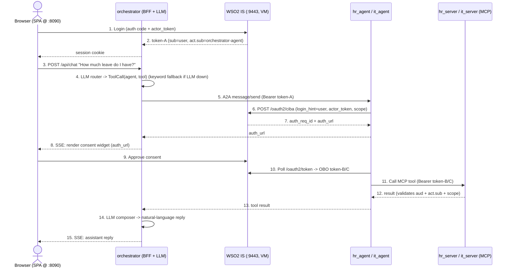

# Smart Employee Assistant — IAM for AI Agents (POC)

A proof-of-concept showing how **AI agents can be first-class IAM identities**. A user
chats with a "smart employee assistant"; behind the scenes, specialist AI agents (HR, IT)
act *on the user's behalf* — and **every action they take is traceable to a human,
scope-bounded, user-consented in real time, and revocable**.

The headline: **the token *is* the authority.** When a specialist agent needs to do
something for you, it initiates a [CIBA](https://openid.net/specs/openid-client-initiated-backchannel-authentication-core-1_0.html)
flow, you approve it on a consent widget, and the agent receives a narrowly-scoped OAuth
token bound to `(you, that-agent, that-resource)`. No standing privilege; no shared
service account doing things in your name without a trace.

This is a **technical demonstration of agent-to-agent (A2A) interaction and identity
governance** — not a product or feature showcase. The HR/IT business logic is incidental;
the point is the identity plumbing underneath it.

> **This is a POC, not production.** Single-process services, in-memory state, a
> self-signed IdP cert, and "correlation-IDs-in-logs" as the audit story. See
> [`docs/milestone-plan.md`](docs/milestone-plan.md) §0 for the full "what this is not" list.

---

## 1. What this demonstrates

| Governance property | How it shows up in the demo |
|---|---|
| **Agents are identities** | `orchestrator-agent`, `hr-agent`, `it-agent` are registered Agent identities in WSO2 Identity Server, each with its own credentials. |
| **Every action is user-consented** | Each specialist runs its **own** per-agent CIBA flow when invoked; you approve a consent widget before it acts. |
| **Least privilege per action** | The on-behalf-of (OBO) token a specialist receives carries only the scope its current tool needs (e.g. `hr_self_rest`), bound to the paired MCP server's audience. |
| **Traceable to a human** | Tokens carry `sub=<user-email>` and `act.sub=<agent UUID>`; logs key off correlation IDs. |
| **Revocable** | Sign-out and admin session termination cascade via back-channel logout + an internal fan-out; a deactivated agent stops working within the actor-token cache TTL (~10 s). |

---

## 2. Architecture

### 2.1 Services

Five Dockerized services (`docker-compose.yml`), plus the IdP which runs separately.

| Service | Host port | Bind | Role |
|---|---|---|---|
| `orchestrator` | `8090` → container `8080` | all interfaces | BFF + browser SPA host + LLM router/composer + A2A client + login (auth-code) + CIBA fan-out + reports proxy + back-channel-logout receiver |
| `hr_agent` | `8001` | loopback only | HR specialist A2A agent; runs its own CIBA, calls `hr_server` MCP tools |
| `it_agent` | `8002` | loopback only | IT specialist A2A agent; same shape as `hr_agent` |
| `hr_server` | `8000` | loopback only | HR MCP tool server + REST (leave, cubicles, reports) |
| `it_server` | `8004` | loopback only | IT MCP tool server + REST (assets, reports) |
| **WSO2 Identity Server** | `9443` | separate VM | IdP. Dev setup uses `https://13.60.190.47:9443` (self-signed cert). |

The browser UI (SPA) is served by the orchestrator at **http://localhost:8090** — there is
no separate client container. Host port `8123` is a **second publish mapping to the same
orchestrator container port `8080`** — not a separate service: it gives the IS VM a dedicated
host port to reach the orchestrator's `/backchannel-logout` route over a reverse-SSH tunnel in
the laptop setup. The back-channel-logout receiver is just that route on the single
orchestrator app. (See [`init_guide.md`](init_guide.md) for the VM deployment where IS
reaches it directly over the VPC.)

### 2.2 Protocols & identity model

- **Browser → orchestrator:** session cookie (set after login).
- **Orchestrator → specialists:** **A2A** JSON-RPC `message/send` (`common/a2a/`), forwarding
  the user's delegated session token (**token-A**) as a Bearer.
- **Specialist → MCP server:** Bearer of a **per-agent CIBA-obtained OBO token**
  (`common/auth/ciba_client.py`, `common/auth/actor_token_provider.py`).
- **Delegation is per-agent CIBA.** Each specialist mints its own OBO token independently —
  the tokens are not chained.

**Tokens in flight:**

| Token | Shape | Issued to | Consumed by |
|---|---|---|---|
| **token-A** | `sub=user`, `aut=APPLICATION_USER`, `act.sub=<orchestrator-agent UUID>`, `aud=<orchestrator-mcp-client>`, `scope="openid orchestrate"` | `orchestrator-mcp-client` (login code exchange) | orchestrator session; forwarded to specialists over A2A |
| **token-B** | `sub=user`, `act.sub=<hr-agent UUID>`, tool-specific scope, `aud=<hr-agent client>` | `hr-agent`'s own CIBA flow | `hr_server` (MCP) |
| **token-C** | `sub=user`, `act.sub=<it-agent UUID>`, tool-specific scope, `aud=<it-agent client>` | `it-agent`'s own CIBA flow | `it_server` (MCP) |

`act.sub` carries each agent's UUID (the names above are shorthand for those UUIDs). token-B
and token-C are **independent** — there is no nested chain between them.

**Identity convention (critical):** every IS user has `username == email == sub == login_hint`
— a single identifier. The three subject-bearing OAuth clients — `orchestrator-mcp-client`,
`hr-agent`, and `it-agent` (NOT `orchestrator-agent`) — assert **email as the OIDC subject**,
so per-user state stays consistent across token-A and the OBO tokens. Background:
[`docs/architecture/identity-subject-mismatch.md`](docs/architecture/identity-subject-mismatch.md).

### 2.3 LLM routing

The orchestrator routes chat turns with **OpenAI (currently `gpt-4.1`, configurable via
`OPENAI_MODEL`; code default is `gpt-4o`) reached through the WSO2 Agent Manager (embedded
WSO2 AI Gateway)** — an OpenAI-compatible endpoint — via `langchain_openai.ChatOpenAI`. Routing
uses **tool/function calling** (`bind_tools`): the tool catalogue is injected as function
schemas and the model returns structured `tool_calls` (there is no JSON-array parsing).

If the gateway/LLM is unreachable, rate-limited, or the key is invalid, chat **automatically
degrades to a deterministic keyword router** — never a hard error. (The keyword router can't
parse natural-language dates, so misrouting is the visible symptom; see Troubleshooting §1.)

### 2.4 Request flow



Key HTTP surfaces on the orchestrator: `GET /auth/login`, `GET /agent-callback`,
`POST /auth/exchange`, `POST /auth/logout`, `POST /api/chat`, `POST /api/ciba/cancel`,
`GET /events/{session_id}` (SSE), `POST /backchannel-logout`, `GET /healthz`.

---

## 3. Capability walkthrough — what the demo proves

Each scenario below is a *vehicle* — it exercises one specific A2A / identity property. The
question every row answers is *"what agent-identity behaviour does this prove?"*, never
*"what HR feature is this?"*

Trigger each from the chat box at **http://localhost:8090** after signing in (roles below).
Routing is LLM-driven; exact wording doesn't matter, only intent. Three live moments are
worth watching for: the **multi-agent fan-out** (one intent → two consents → two scoped
tokens, §B); the **revocation "wedge"** (replay a token that just worked → `401 ERR-MCP-002`,
§D); and **least-privilege denied at the IdP** (an Employee asks to approve → the token is
never minted, §C).

### A. An agent acting on-behalf-of a user, with real-time consent (the core thesis)
The agent has no standing privilege. When invoked it runs its own per-agent CIBA flow; you
approve a consent widget; it receives an OBO token bound to (you, that-agent, that-resource)
and nothing more. **Reads and writes BOTH go through this consent-gated CIBA path** — there is
no "read shortcut" for agent tools.

| Trigger query | Proves |
|---|---|
| "How much annual leave do I have?" | A read still mints a fresh, scoped OBO token (`sub=you`, `act.sub=hr-agent`) only after consent. The token *is* the authority. |
| "I'd like annual leave from 2026-06-10 to 2026-06-14, reason: family trip" | A write runs the same consent-gated CIBA path; nothing is written until you approve. |
| (HR Admin) "show me vacant cubicles" → "floor 2" → "assign C-027 to jane.doe" | The consent widget names the specific target of the write — consent is bound to the action, not a blanket grant. |

### B. Multi-agent fan-out — one human intent, several scoped delegations
| Trigger query | Proves |
|---|---|
| "How much annual leave do I have, and where's my cubicle?" | Two agents, two independent consents, two distinct scoped tokens, one composed reply. |
| (HR Admin) "onboard a new hire: seat, laptop and phone" | Multi-tool fan-out across both agents in one turn — each tool call is its own delegated, scoped action; no batch consent. |

### C. Least privilege & policy enforcement at the IdP — not the app
| Trigger query | Proves |
|---|---|
| (Employee) "approve the leave request for Bob" | IS refuses the elevated scope (`hr_approve_rest`) for the `employee` role — the token is never issued. |
| (Employee) "issue a laptop to Carol" | Same on the IT side (`it_assets_write_rest`). The agent physically cannot exceed the user's role. |

### D. Revocation — the token is not authority forever
| Trigger | Proves |
|---|---|
| User clicks Sign out | Logout cascade: cancels in-flight consents, revokes token-A at IS, denylists the OBO token `jti` on every MCP receiver. Replaying a previously-valid token-B → `401 ERR-MCP-002` (denylist_hit). |
| Admin Terminates the session in IS Console | Back-channel logout drives the same cascade from the IdP side. **Environment-gated:** IS is remote on AWS, so this needs the reverse-SSH tunnel rig. |
| Agent deactivated in IS Console | Next token mint rejected by IS; the actor-token cache TTL bounds the lag to ~10 s (see Troubleshooting §6). |

### E. Non-CIBA & unauthenticated boundaries (the contrast paths)
| Trigger | Proves |
|---|---|
| HR Admin Reports tables (Cubicles / Devices / Pending Leaves) | The **only** CIBA-free reads: orchestrator-proxied REST on the admin's own session token-A — NO agent, NO CIBA. The deliberate counterpoint to the delegated flows; role scope (`hr_read_rest` / `it_assets_read_rest`) is checked before the backend. |
| (pre-login widget) "What are the public holidays this year?" | Identity-free by design — answered from static knowledge, with no token, no session, no agent, no MCP call. |
| (pre-login widget) "How many sick days do I have left?" | Declined and redirected to sign-in — personal data is structurally unreachable before login. |

> Full storyboards: [`docs/demo-runbook.md`](docs/demo-runbook.md). Formal per-scenario use
> cases: [`docs/use-cases/`](docs/use-cases/).

---

## 4. How to run

### 4.1 Prerequisites

- **Docker** + **Docker Compose v2** (`docker compose version` → v2.x)
- **python3** (for the smoke / preflight scripts; uses stdlib + optional `httpx`)
- A **reachable WSO2 Identity Server** configured per §6 (dev: `https://13.60.190.47:9443`)
- A **WSO2 Agent Manager (embedded WSO2 AI Gateway) endpoint + OpenAI API key** for LLM
  routing (optional — without it the keyword router still works)

### 4.2 Per-service `.env`

Each service reads its own `.env` (see `docker-compose.yml` `env_file:` entries):
`orchestrator/.env`, `hr_agent/.env`, `it_agent/.env`, `hr_server/.env`, `it_server/.env`.
These hold IS client IDs/secrets, agent credentials, scopes, and the WSO2 AI Gateway / OpenAI
settings. **Do not commit them** — they contain live secrets. The full variable list and where
each value comes from is in [`docs/wso2-is-setup.md`](docs/wso2-is-setup.md) §7–8. Headline
vars:

| Variable (where) | Meaning |
|---|---|
| `WSO2_IS_BASE_URL`, `WSO2_IS_JWKS_URL`, `WSO2_IS_ISSUER` (all) | IdP endpoints |
| `IDP_INSECURE_TLS=1` / `DISABLE_SSL_VERIFY=true` | accept the self-signed dev cert |
| `ORCHESTRATOR_MCP_CLIENT_ID` / `_SECRET` / `_REDIRECT_URI` (orchestrator) | confidential BFF OAuth client; redirect is `http://localhost:8090/agent-callback` |
| `ORCHESTRATOR_AGENT_ID` / `_SECRET` / `_OAUTH_CLIENT_ID` / `_OAUTH_CLIENT_SECRET` (orchestrator) | the orchestrator agent's 4-value credential tuple |
| `HR_AGENT_*` / `IT_AGENT_*` (agents) | each specialist's 4-value credential tuple |
| `HR_CIBA_SCOPE` / `IT_CIBA_SCOPE` (agents) | default CIBA scope, e.g. `openid hr_self_rest` |
| `HR_SERVER_EXPECTED_AUD` / `IT_SERVER_EXPECTED_AUD` (servers) | == the paired agent's OAuth client id |
| `HR_SERVER_TRUSTED_PEER_AGENTS` / `IT_SERVER_TRUSTED_PEER_AGENTS` (servers); `HR_TRUSTED_PEER_AGENTS` / `IT_TRUSTED_PEER_AGENTS` (agents) | allowlist of agent UUIDs permitted in the `act` chain (note: the agent-side names have no `_SERVER` infix) |
| `INTERNAL_REVOKE_SHARED_SECRET` (all, via shell/`.env`) | shared secret for the revoke fan-out; **must be identical across all containers** |
| `LLM_FALLBACK_MODE`, `OPENAI_BASE_URL`, `OPENAI_API_KEY`, `OPENAI_API_HEADER`, `OPENAI_MODEL` (orchestrator) | LLM routing via the WSO2 AI Gateway |

### 4.3 Bring it up

```bash
./scripts/demo-up.sh             # build (cached layers) + start + healthz smoke
./scripts/demo-up.sh --clean     # down (+orphans) + no-cache rebuild + start + smoke
./scripts/demo-up.sh --no-build  # start using existing images (no build)

./scripts/demo-down.sh           # stop + remove containers
```

`make demo-up` / `make demo-down` / `make demo-smoke` wrap the same scripts.

### 4.4 Verify

```bash
python3 scripts/demo-smoke.py    # GET /healthz on all 5 services + SPA root
./scripts/check-is-config.py     # full WSO2 IS preflight (run this if anything 401s)
open http://localhost:8090       # the SPA
```

### 4.5 Demo credentials & queries

| User | Password | Role | Surface |
|---|---|---|---|
| `employee@example.com` | `NewsMax@1234` | `employee` | self-service (own leave, own cubicle) |
| `hradmin@example.com` | `NewsMax@1234` | `HR Admin` | Reports page + cubicle assignment |

(`NewsMax@1234` is the default demo password — verify against your IS user records.)

Example chat queries (the LLM router extracts the arguments):

- Employee: *"How much annual leave do I have, and where's my cubicle?"*
- Employee: *"I'd like annual leave from 2026-06-10 to 2026-06-14, reason: family trip"*
- HR Admin: *"Show me vacant cubicles"* → *"floor 2"* → *"assign C-027 to jane.doe"*

The canonical two-specialist storyboard is [`docs/use-cases/UC-03-two-specialist-serial-query.md`](docs/use-cases/UC-03-two-specialist-serial-query.md).

### 4.6 Tests

```bash
./tools/run-tests.sh        # runs each tests/test_*.py file in isolation
make test                   # same
```

> **Deeper docs:** VM/cloud deployment → [`init_guide.md`](init_guide.md); demo walkthrough →
> [`docs/demo-runbook.md`](docs/demo-runbook.md); architecture → [`docs/architecture/`](docs/architecture/)
> (module layout, sequence diagrams, API contracts).

---

## 5. Troubleshooting

### 1. Chat returns generic help, or routes to the wrong tool
**Symptom:** "apply for leave" returns a policy lookup, or you get a flat "I don't know how
to help"; natural-language dates aren't parsed.
**Cause:** the LLM path is down, so chat fell back to the keyword router. The WSO2 AI Gateway
route is undeployed (HTTP **404**) or `OPENAI_BASE_URL` is stale. (A **401** means the route
is fine but the key/auth is wrong.)
**Probe:** `curl -s -o /dev/null -w "%{http_code}" -X POST "$OPENAI_BASE_URL/chat/completions"`
should return **401**, not 404.
**Fix:** confirm the gateway route is deployed, update `OPENAI_BASE_URL` in
`orchestrator/.env`, then `docker compose up -d --no-deps --force-recreate orchestrator`.

### 2. `401 invalid_secret` on cascade / fan-out
**Cause:** secret drift — a partial compose restart left some containers on a stale
shell-env value and others on the current `.env`, so `INTERNAL_REVOKE_SHARED_SECRET` no
longer matches across the fleet.
**Fix:** recreate **all** containers together with one identical secret:
`./scripts/demo-up.sh --clean`.

### 3. "The agent doesn't have permission right now" / CIBA actor-token failure
**Symptom:** the composer renders the plain-language "no permission right now" reply;
logs show `ERR-CIBA-009` / `login.fail`.
**Cause:** the agent's IS credentials were rotated/deactivated, or its `*_SECRET` in the
service `.env` is stale.
**Fix:** regenerate the agent secret in the IS Console, update the matching service `.env`
(`ORCHESTRATOR_AGENT_SECRET` / `HR_AGENT_SECRET` / `IT_AGENT_SECRET`), then restart that
service. `scripts/check-is-config.py` Section 4d catches this before runtime.

### 4. `Bind for 127.0.0.1:8000 failed: port is already allocated`
**Cause:** leftover containers from a previous compose project name (the project name = the
directory basename, so a directory rename creates a new project while the old containers
still hold the ports).
**Fix:** `docker compose -p <old-project> down --remove-orphans`, then bring up under the
new name.

### 5. Anything 401s against WSO2 IS
**Fix:** run `./scripts/check-is-config.py` (full preflight). The most common root cause is
the identity-subject convention — every OAuth app must assert **email as subject**, and
`username == email == sub == login_hint`. See §6 and [`docs/architecture/identity-subject-mismatch.md`](docs/architecture/identity-subject-mismatch.md).

### 6. Agent deactivation appears to lag (~10 s)
**Expected, not a bug.** The in-process actor-token cache is capped at ~10 s
(`ACTOR_TOKEN_CACHE_MAX_TTL_SECONDS = 10` in `common/auth/actor_token_provider.py`), so an
IS deactivation takes effect on the **next mint** — up to ~10 s later. IS does not
invalidate already-issued JWTs, so this cache TTL is the dominant revocation control.

### 7. Back-channel logout token has no `typ=logout+jwt`
**Expected accommodation.** This IS release omits `typ` on the BCL token; the receiver
soft-checks `typ` (absent is OK, present-and-wrong is rejected). The `events` claim remains
the categorical separator. Don't "fix" it.

### 8. `ModuleNotFoundError` after moving the repo directory
**Cause:** a Python `.venv` bakes absolute paths; after a directory rename,
`source .venv/bin/activate` then breaks.
**Fix:** recreate the venv (or repoint the baked paths). The Docker path is unaffected — the
venv only matters for running scripts/tests on the host.

More IS-specific failures (`unauthorized_client`, consent widget never resolving, `aud`
mismatch) are in [`docs/wso2-is-setup.md`](docs/wso2-is-setup.md) §10.

---

## 6. Configuring WSO2 Identity Server

Full step-by-step walkthrough (≈45 min first time): **[`docs/wso2-is-setup.md`](docs/wso2-is-setup.md)**.
Rebuild-from-scratch runbook: [`docs/wso2-is-rebuild-runbook.md`](docs/wso2-is-rebuild-runbook.md).
CIBA grant reference: [`docs/configuring-ciba-grant-type.md`](docs/configuring-ciba-grant-type.md).
Preflight checker: `scripts/check-is-config.py`. Summary of what you configure:

**OAuth applications (3):**

| App | Type | Purpose |
|---|---|---|
| `orchestrator-mcp-client` | Standard-Based (OIDC, **confidential**) | The single runtime login client — used for **both** the `/authorize` redirect and the `/token` code exchange (IS rejects cross-client code redemption). Redirect URI `http://localhost:8090/agent-callback`. Subject = **Email**. |
| `hr-agent` (auto-created OAuth app) | backs the `hr-agent` Agent identity | CIBA-grant client for HR. Subject = **Email**. |
| `it-agent` (auto-created OAuth app) | backs the `it-agent` Agent identity | CIBA-grant client for IT. Subject = **Email**. |

**Agent identities (3):** `orchestrator-agent`, `hr-agent`, `it-agent` — each created under
Console → Agents with "Allow users to log in" ON, which auto-creates the backing OAuth app.
Each agent yields a **4-value tuple**: Agent ID (UUID, = `sub`/`act.sub`), Agent Secret,
OAuth Client ID, OAuth Client Secret.

**CIBA grant config** (on each agent's auto-created OAuth app):
- Enable the **CIBA** grant (not on by default).
- CIBA request expiry `300`.
- **Allowed Notification Delivery Method = External** (mandatory — without it CIBA returns
  no `auth_url`).

**API resources & scopes** (single-tier `<resource>_<action>_rest` naming; the authoritative
inventory is `scripts/check-is-config.py` + [`docs/wso2-is-rebuild-runbook.md`](docs/wso2-is-rebuild-runbook.md)):
- `urn:hr:api` — `hr_basic_rest`, `hr_self_rest`, `hr_read_rest`, `hr_approve_rest`, `hr_assets_write_rest`
- `urn:it:api` — `it_assets_read_rest`, `it_assets_self_rest`, `it_assets_write_rest`

Subscribe `hr-agent`'s OAuth app to all **5** HR scopes and `it-agent`'s to all **3** IT scopes.
(`hr_assets_write_rest` is easy to miss on the HR side; `it_assets_self_rest` is the easy
miss on the IT side — both silently strip at CIBA if unsubscribed, surfacing later as a 401 /
under-scoped token. `check-is-config.py` §4c verifies both.)

**Roles (Organization audience)** — IS does **not** inherit role scopes, so each is listed
explicitly (role name `employee` is **lowercase**; `HR Admin` is capitalized):
- `employee` → `hr_basic_rest`, `hr_self_rest`, `it_assets_read_rest`, `it_assets_self_rest`
- `HR Admin` → all of `employee`'s **plus** `hr_read_rest`, `hr_approve_rest`, `hr_assets_write_rest`, `it_assets_write_rest`

**Email-as-subject claim mapping:** on each of the 3 OAuth apps, set User Attributes →
Subject → **Assign alternate subject identifier, Subject attribute = Email, Subject type =
Public**, and select Email under attribute selection. This makes token-A and the OBO tokens
share the same `sub`.

**Demo users:** create each with **username = email address**:
`employee@example.com` (role `employee`) and `hradmin@example.com` (role `HR Admin`), both
with the demo password.

**Back-channel logout:** the MCP Client Application template doesn't expose
`backChannelLogoutUrl` / post-logout-redirect coverage in the Console UI — set both with
`scripts/set-bcl-url.sh` (idempotent GET→merge→PUT). `check-is-config.py` §4b fails if
either is missing.

---

## License

See [`LICENSE`](LICENSE).
