# Module Layout — Sprint 1

**Date:** 2026-05-07
**Status:** Authoritative Stage 4 artifact. Frozen for Stage 6 parallel implementation.
**Supersedes:** Sprint 0 stubs in `orchestrator/main.py`, `hr_agent/main.py`, `it_agent/main.py`.


## Directory tree

The five services are `orchestrator`, `hr_agent`, `it_agent`, `hr_server`, `it_server`
(see `docker-compose.yml`). The browser SPA is **not** a separate service: the static
assets in `client/` are baked into the orchestrator image and served by it via a
`StaticFiles` mount at `/static` (orchestrator on `localhost:8090`). There is no
`localhost:3001` SPA host and no `localhost:5001` `agent` service — both pre-v4
scaffolds were removed.

```
<repo-root>/
├── common/
│   ├── __init__.py
│   ├── auth/
│   │   ├── __init__.py
│   │   ├── models.py              # OAuthToken, OBOToken, JWTClaims, CIBARequest
│   │   ├── errors.py              # (existing) AuthError, ErrorEnvelope, error codes
│   │   ├── jwt_validator.py       # (existing stub → Sprint 1 impl) JWKS + claim validation
│   │   ├── peer_trust.py          # (existing) depth-1 act chain validation
│   │   ├── wso2_is_client.py      # App-Native Auth 3-step + Pattern C /token
│   │   ├── actor_token_provider.py# Cached agent I4 token, cache capped 10s + 2s refresh buffer
│   │   └── ciba_client.py         # initiate, poll, acquire_obo; full error hierarchy
│   ├── a2a/
│   │   ├── __init__.py
│   │   ├── models.py              # A2ARequest, A2AResponse, ConsentRequired, A2AResult
│   │   ├── client.py              # (existing stub → Sprint 1 impl) POST /a2a/message/send
│   │   ├── server.py              # FastAPI router factory for hosting /a2a endpoint
│   │   ├── agent_card.py          # (existing) AgentCard Pydantic model
│   │   └── jsonrpc.py             # (existing) JSON-RPC 2.0 helpers
│   └── logging/
│       ├── __init__.py
│       ├── correlation.py         # X-Request-ID middleware + context var
│       └── redaction.py           # Regex-strip JWTs, auth_req_id, actor_token from logs
│
├── orchestrator/
│   ├── main.py                    # FastAPI app assembly + lifespan
│   ├── config.py                  # All env-var parsing for orchestrator
│   ├── auth/
│   │   ├── __init__.py
│   │   ├── routes.py              # GET /auth/login, GET /auth/callback, POST /auth/exchange
│   │   ├── session_store.py       # OrchestratorSession, SessionStore (adapted from archive)
│   │   └── pattern_c.py           # PKCE state generation + token-A exchange logic
│   ├── chat/
│   │   ├── __init__.py
│   │   ├── routes.py              # POST /api/chat, POST /api/ciba/cancel
│   │   ├── keyword_fallback.py    # Deterministic "leave"→hr_agent, "laptop"→it_agent
│   │   ├── public_handler.py      # Pre-login public info widget (no identity)
│   │   └── public_routes.py       # POST /public/chat (unauthenticated)
│   ├── llm/
│   │   ├── __init__.py
│   │   ├── router.py              # LLMRouter — bind_tools() function-calling → tool_calls
│   │   ├── composer.py            # Reply composer (tool outcomes → NL reply)
│   │   ├── client.py              # LLM client protocol + FakeLLMClient (tests)
│   │   ├── amp_client.py          # OpenAILLMClient — ChatOpenAI via the WSO2 AI Gateway
│   │   └── prompts.py             # Router + composer prompt templates
│   ├── events/
│   │   ├── __init__.py
│   │   └── sse.py                 # SSE stream GET /events/{session_id}; push helpers
│   └── agent_registry/
│       ├── __init__.py
│       ├── cards.py               # In-memory card cache + TTL refresh
│       └── discovery.py           # discover_agents() called by LLM tool
│
├── hr_agent/
│   ├── main.py                    # FastAPI app assembly + lifespan
│   ├── config.py                  # All env-var parsing for hr_agent
│   ├── a2a/
│   │   ├── __init__.py
│   │   └── handler.py             # JWT validation + dispatch to ciba/orchestrator.py
│   ├── ciba/
│   │   ├── __init__.py
│   │   └── orchestrator.py        # Initiate CIBA, manage poll task, return auth_url or token
│   └── mcp/
│       ├── __init__.py
│       └── client.py              # MCP tool calls to hr_server with token-B
│
├── it_agent/                      # Mirror of hr_agent with it.* scope + it_server target
│   ├── main.py
│   ├── config.py
│   ├── a2a/
│   │   ├── __init__.py
│   │   └── handler.py
│   ├── ciba/
│   │   ├── __init__.py
│   │   └── orchestrator.py
│   └── mcp/
│       ├── __init__.py
│       └── client.py
│
├── hr_server/                     # (existing, adapted for Sprint 1 token validation)
│   ├── main.py
│   ├── config.py
│   ├── auth/
│   │   ├── __init__.py
│   │   ├── validators.py          # Sprint 1: aud + act.sub + scope enforcement
│   │   ├── jwt_validator.py       # (existing)
│   │   ├── context.py             # (existing)
│   │   └── scopes.py              # (existing)
│   └── mcp/
│       ├── __init__.py
│       └── tools.py               # get_leave_balance (Sprint 1 canned stub)
│
├── it_server/                     # Mirror of hr_server with it.* scope
│   ├── main.py
│   ├── config.py
│   ├── auth/
│   │   ├── __init__.py
│   │   ├── validators.py
│   │   ├── jwt_validator.py
│   │   ├── context.py
│   │   └── scopes.py
│   └── mcp/
│       ├── __init__.py
│       └── tools.py               # list_available_assets (Sprint 1 canned stub)
│
└── client/                        # SPA static assets — baked into the orchestrator
    │                               # image (/app/client_static) and served by it at
    │                               # /static. NOT a separate running service.
    ├── index.html                  # single-page shell
    ├── app.js                      # login/PKCE, chat, SSE consumer, consent widget (one file)
    ├── styles.css
    └── serve.py                    # standalone dev static server (not used in the compose fleet)
```


## `common/auth/models.py`

**Purpose:** Shared dataclass / Pydantic v2 types for OAuth tokens, CIBA state, and validated JWT claims used across all five services.

```python
from __future__ import annotations
import time
from dataclasses import dataclass, field
from typing import Any
from pydantic import BaseModel

REFRESH_BUFFER_SECONDS: int = 30

@dataclass(frozen=True)
class OAuthToken:
    """Raw /oauth2/token response (any grant type)."""
    access_token: str; token_type: str; expires_in: int; scope: str
    id_token: str | None = None

@dataclass
class OBOToken:
    """Depth-1 CIBA OBO token: sub=user, act.sub=specialist, aud=agent-client-id."""
    access_token: str; expires_in: int; scope: str
    sub: str; act_sub: str; aud: str
    jti: str | None; iat: float; expires_at: float

    @property
    def is_valid(self) -> bool:
        """True if not expired (30s buffer)."""
        return time.time() < (self.expires_at - REFRESH_BUFFER_SECONDS)

@dataclass(frozen=True)
class JWTClaims:
    """Post-validation JWT claims surface."""
    sub: str; iss: str; aud: str | list[str]; exp: int; iat: int
    scope: str; act: dict[str, Any] | None; jti: str | None
    sid: str | None; aut: str | None; raw: dict[str, Any]

    @property
    def scopes(self) -> list[str]:
        """scope string split into list."""
        return self.scope.split() if self.scope else []

    @property
    def act_sub(self) -> str | None:
        """Immediate actor sub from depth-1 act claim."""
        return self.act.get("sub") if isinstance(self.act, dict) else None

@dataclass
class CIBARequest:
    """State returned by /oauth2/ciba; held by specialist during polling."""
    auth_req_id: str; auth_url: str
    interval: int       # IS default: 2s
    expires_in: int     # IS default: 300s
    issued_at: float = field(default_factory=time.time)

    @property
    def expires_at(self) -> float: return self.issued_at + self.expires_in

    @property
    def remaining_seconds(self) -> int: return max(0, int(self.expires_at - time.time()))

class TokenScopeSet(BaseModel):
    """Cache key for per-(user_sub, scope_set) OBO token in specialist agents."""
    user_sub: str; scopes: frozenset[str]
    model_config = {"frozen": True}
```


## `common/auth/jwt_validator.py`

**Purpose:** JWKS-backed JWT signature and claim validation; replaces Sprint 0 stub.
**Reuse:** adapted from `_archive/agent.before-v3/main.py:94-180` (JWKS fetch, kid lookup, pyjwt decode block).

```python
from __future__ import annotations
from dataclasses import dataclass
from typing import Any
from .models import JWTClaims

JWKS_CACHE_TTL_SECONDS: int = 300
CLOCK_SKEW_SECONDS: int = 5

@dataclass(frozen=True)
class ValidatorConfig:
    """Per-service config; all fields read from env at startup."""
    issuer: str
    expected_aud: str          # exact-match; MCP servers: agent OAuth Client ID
    required_scopes: list[str]
    require_act: bool = True
    jwks_url: str = ""
    allowed_act_subs: frozenset[str] = frozenset()

class JWTValidator:
    """Async JWKS-cached JWT validator; one instance per service process."""

    def __init__(self, cfg: ValidatorConfig, *, insecure_tls: bool = False) -> None:
        """Build httpx client; defer first JWKS fetch to first validate() call."""
        ...

    async def validate(self, token: str) -> JWTClaims:
        """Validate sig, exp±skew, iss, aud, scopes, act chain; raise AuthError on failure."""
        ...
    async def _get_signing_key(self, kid: str) -> Any: ...
    async def _fetch_jwks(self) -> dict: ...
```


## `common/auth/wso2_is_client.py`

**Purpose:** Async HTTP helpers for App-Native Auth (3-step), Pattern C `/token` exchange, and JWKS fetch.
**Reuse:** 3-step flow ported from `idp_capability_test/c8_ciba.py:mint_agent_token_via_authn` (lines 62-127).

```python
from __future__ import annotations
import httpx
from .models import OAuthToken

class WSO2ISClient:
    """Low-level async client for WSO2 IS OAuth2 endpoints; stateless (no token cache)."""

    def __init__(self, *, base_url: str, insecure_tls: bool = False,
                 timeout_seconds: float = 10.0) -> None:
        """Build httpx.AsyncClient; insecure_tls for dev self-signed cert."""
        ...

    async def app_native_authn(
        self, *, oauth_client_id: str, oauth_client_secret: str,
        agent_username: str, agent_password: str,
        redirect_uri: str, scope: str = "openid internal_login",
    ) -> OAuthToken:
        """3-step /authorize→/authn→/token; return I4 token. Raises ValueError on missing flowId/code."""
        ...
    async def exchange_pattern_c(
        self, *, oauth_client_id: str, oauth_client_secret: str,
        code: str, code_verifier: str, redirect_uri: str, actor_token: str,
    ) -> OAuthToken:
        """Pattern C code exchange → token-A. Raises AuthError on invalid_grant."""
        ...

    async def fetch_jwks(self, jwks_url: str) -> dict: ...
    async def aclose(self) -> None: ...
```


## `common/auth/actor_token_provider.py`

**Purpose:** Caches the specialist agent's I4 token; the in-process actor-token cache is capped at 10s (`ACTOR_TOKEN_CACHE_MAX_TTL_SECONDS`) with a 2s refresh buffer (`REFRESH_BUFFER_SECONDS`) — the JWT's own `exp` is still IS-issued (~1h) but the cache re-mints every 10s via `WSO2ISClient.app_native_authn()`.
**Reuse:** caching pattern ported from `_archive/agent.before-v3/agent_auth.py:AgentAuth.ensure_valid_token()` (lines 58-93).

```python
from __future__ import annotations
import asyncio
from .models import OAuthToken
from .wso2_is_client import WSO2ISClient

REFRESH_BUFFER_SECONDS: int = 2          # re-mint this many seconds before expiry
ACTOR_TOKEN_CACHE_MAX_TTL_SECONDS: int = 10  # hard cap on cached lifetime (bounds deactivation lag)

class ActorTokenProvider:
    """Cached I4 token provider; one instance per specialist process."""

    def __init__(
        self, *, is_client: WSO2ISClient,
        oauth_client_id: str, oauth_client_secret: str,
        agent_username: str, agent_password: str,
        redirect_uri: str, scope: str = "openid internal_login",
    ) -> None:
        """Store credentials; defer first mint to first get() call."""
        ...

    async def get(self) -> OAuthToken:
        """Return valid I4 token; coalesce concurrent refreshes via asyncio.Lock."""
        ...
    async def _mint(self) -> None: ...
    @property
    def expires_at(self) -> float: ...
```


## `common/auth/ciba_client.py`

**Purpose:** Initiates CIBA, polls `/oauth2/token` with RFC back-off, assembles `OBOToken`; owns full error hierarchy.
**Reuse:** polling loop + error codes ported from `idp_capability_test/c8_ciba.py:main()` (lines 254-296).

```python
from __future__ import annotations
import asyncio
from dataclasses import dataclass
from .models import CIBARequest, OBOToken

# ── Error hierarchy ──────────────────────────────────────────────────────────

class CIBAError(Exception):
    """Base; carries auth_req_id for correlation."""
    def __init__(self, message: str, auth_req_id: str | None = None) -> None: ...

class CIBADeniedError(CIBAError):
    """IS returned error=access_denied."""

class CIBAExpiredError(CIBAError):
    """IS returned error=expired_token."""

class CIBATimeoutError(CIBAError):
    """Local polling budget exhausted or cancel_event fired."""

class CIBAInitiationError(CIBAError):
    """POST /oauth2/ciba returned error (not auth_req_id)."""
    def __init__(self, message: str, error_code: str, error_description: str) -> None: ...

# ── Binding message (S1.11b) ─────────────────────────────────────────────────

BINDING_MESSAGE_TEMPLATE = (
    "{agent_label} wants to {action_summary} on your behalf — request {correlation_id_short}"
)

def format_binding_message(*, agent_label: str, action_summary: str, correlation_id: str) -> str:
    """Format binding_message; truncate correlation_id to first 8 chars."""
    ...

# ── Config + client ──────────────────────────────────────────────────────────

@dataclass
class CIBAClientConfig:
    ciba_endpoint: str; token_endpoint: str
    oauth_client_id: str; oauth_client_secret: str
    max_poll_seconds: int = 240; insecure_tls: bool = False

class CIBAClient:
    """Async CIBA client; one instance per specialist process; stateless between calls."""

    def __init__(self, cfg: CIBAClientConfig) -> None: ...

    async def initiate(
        self, *, login_hint: str, scope: str, binding_message: str,
        actor_token: str, notification_channel: str = "external",
    ) -> CIBARequest:
        """POST /oauth2/ciba; raise CIBAInitiationError on IS error; warn if auth_url absent."""
        ...

    async def poll_for_token(
        self, *, ciba_request: CIBARequest,
        cancel_event: asyncio.Event | None = None,
    ) -> OBOToken:
        """Poll /oauth2/token; back-off start=interval, +5s on slow_down; cap at max_poll_seconds.

        Raises CIBADeniedError, CIBAExpiredError, CIBATimeoutError.
        cancel_event fires → CIBATimeoutError("cancelled").
        """
        ...

    async def acquire_obo(
        self, *, login_hint: str, scope: str, actor_token: str,
        agent_label: str, action_summary: str, correlation_id: str,
        cancel_event: asyncio.Event | None = None,
    ) -> tuple[CIBARequest, asyncio.Task[OBOToken]]:
        """initiate() + start poll_task; return immediately so caller streams auth_url first."""
        ...

    async def aclose(self) -> None: ...
```


## `common/auth/peer_trust.py`

**Purpose:** Act chain validation against peer-agent allowlist. Sprint 0 complete; no Sprint 1 file changes.

Public surface (implemented at `common/auth/peer_trust.py`):

```python
def extract_chain(claims: dict) -> list[str]:
    """Return outermost-to-innermost actor sub values; [] if act absent."""
    ...

def validate_chain(claims: dict, allowed_peers: set[str],
                   require_non_empty: bool = True) -> list[str]:
    """Walk act chain; every link must be in allowed_peers.
    Raises AuthError(401) if chain empty+required; AuthError(403) on unknown peer.
    """
    ...
```

Caller note: `allowed_peers` must contain the WSO2 IS Agent identity UUIDs — `act.sub` in Pattern C / OBO tokens is the agent UUID, not the display name.


## `common/a2a/models.py`

**Purpose:** Discriminated-union Pydantic v2 shapes for A2A `message/send`; shared by orchestrator (client) and specialists (server).

```python
from __future__ import annotations
from typing import Annotated, Literal, Union
from pydantic import BaseModel, Field

class A2AMessageRequest(BaseModel):
    """JSON-RPC params for message/send."""
    tool: str; args: dict; correlation_id: str  # X-Request-ID from SPA

class ConsentRequired(BaseModel):
    type: Literal["consent_required"] = "consent_required"
    auth_req_id: str; auth_url: str
    agent_label: str; action_summary: str; binding_message: str
    expires_in: int
    is_refresh: bool = False         # True on UC-06 re-CIBA
    prior_consent_at: float | None = None  # iat of expired token (UC-06)

class A2AResult(BaseModel):
    type: Literal["result"] = "result"
    payload: dict                    # e.g. {"leave_days": 12}
    token_jti: str | None = None     # for session map S1.11
    token_exp: float | None = None

class A2AError(BaseModel):
    type: Literal["error"] = "error"
    reason: str    # "user_denied_consent" | "consent_window_expired" | "backend_unavailable"
    message: str   # human-readable for LLM composition

A2AResponse = Annotated[Union[ConsentRequired, A2AResult, A2AError], Field(discriminator="type")]
```


## `common/a2a/client.py`

**Purpose:** Orchestrator-side async client for dispatching `message/send`; replaces Sprint 0 stub.
**Reuse:** Sprint 0 scaffold at `common/a2a/a2a_client.py` (retains `A2AClientConfig`, `HeaderCallable`).

```python
from __future__ import annotations
from typing import Awaitable, Callable
from .models import A2AMessageRequest, A2AResponse
from .agent_card import AgentCard

HeaderCallable = Callable[[], Awaitable[dict[str, str]]]

class A2AClient:
    """Fetch agent cards, dispatch JSON-RPC message/send; one instance per orchestrator."""

    def __init__(
        self, *, allowed_card_urls: list[str],
        card_cache_ttl_seconds: int = 300, refresh_cooldown_seconds: int = 30,
        timeout_seconds: float = 10.0, insecure_tls: bool = False,
    ) -> None: ...

    async def discover_all(self) -> list[tuple[str, AgentCard]]:
        """Fetch all allowlisted card URLs; validate, cache 5 min; skip unreachable with WARNING."""
        ...
    async def message_send(
        self, *, agent_url: str, request: A2AMessageRequest, get_headers: HeaderCallable,
    ) -> A2AResponse:
        """POST /a2a/message/send; inject headers; raise httpx/JsonRpcError on failure."""
        ...
    async def aclose(self) -> None: ...
```


## `common/a2a/server.py`

**Purpose:** FastAPI router factory that specialists mount to host `/a2a/message/send`; handles JSON-RPC envelope, auth, and error mapping.

```python
from __future__ import annotations
from typing import Callable, Awaitable
from fastapi import APIRouter

DispatchFn = Callable[[str, dict, str, str], Awaitable[dict]]
"""Async (tool, args, user_sub, correlation_id) → raw result dict."""

def build_a2a_router(
    *,
    dispatch: DispatchFn,
    validate_bearer: Callable[[str], Awaitable[dict]],
) -> APIRouter:
    """Return APIRouter with POST /message/send.

    1. Extract Bearer → 401 if absent.
    2. validate_bearer(token) → claims; map AuthError → JSON-RPC error.
    3. JsonRpcRequest.from_body() parse.
    4. dispatch(tool, args, claims["sub"], correlation_id).
    5. Return JSON-RPC success_response or error_response.
    """
    ...
```


## `common/logging/correlation.py`

**Purpose:** Starlette middleware that reads/generates `X-Request-ID`, stores in `ContextVar`, echoes on response.

```python
from __future__ import annotations
import contextvars
from starlette.middleware.base import BaseHTTPMiddleware
from starlette.requests import Request
from starlette.responses import Response

REQUEST_ID_HEADER: str = "X-Request-ID"
_request_id_var: contextvars.ContextVar[str] = contextvars.ContextVar("request_id", default="")

def get_request_id() -> str:
    """Return current request correlation ID; empty string if not set."""
    ...

class CorrelationMiddleware(BaseHTTPMiddleware):
    """Read X-Request-ID from request; generate UUID4 if absent; add to response."""

    async def dispatch(self, request: Request, call_next) -> Response:
        """Set context var; call next; add X-Request-ID header to response."""
        ...
```


## `common/logging/redaction.py`

**Purpose:** Log filter regex-stripping JWT-shaped strings, `auth_req_id`, `actor_token` from records (S1.11c).

```python
from __future__ import annotations
import logging, re

_JWT_PATTERN      = re.compile(r"eyJ[A-Za-z0-9_-]+\.[A-Za-z0-9_-]+\.[A-Za-z0-9_-]+")
_BEARER_PATTERN   = re.compile(r"Bearer\s+\S+", re.IGNORECASE)
_AUTH_REQ_PATTERN = re.compile(r"(auth_req_id[=:\s]+)\S+", re.IGNORECASE)
_ACTOR_TK_PATTERN = re.compile(r"(actor_token[=:\s]+)\S+", re.IGNORECASE)
REDACTED: str = "[REDACTED]"

def redact(text: str) -> str:
    """Apply all patterns to text; return sanitised copy."""
    ...

class RedactionFilter(logging.Filter):
    """Mutates record.msg and record.args in-place; always returns True."""

    def filter(self, record: logging.LogRecord) -> bool: ...

def install_redaction_filter(logger_name: str = "") -> None: ...
```


## `orchestrator/config.py`

**Purpose:** Single source of truth for all env vars consumed by the orchestrator.

```python
from __future__ import annotations
from dataclasses import dataclass

@dataclass(frozen=True)
class OrchestratorConfig:
    host: str; port: int
    # IS endpoints
    is_base_url: str; is_authorize_url: str; is_token_url: str
    is_jwks_url: str; is_issuer: str; insecure_tls: bool  # IDP_INSECURE_TLS=1
    # OAuth client (single confidential login client — same client_id on
    # /oauth2/authorize and the /oauth2/token code-exchange).
    # Field is `mcp_client_id` (from ORCHESTRATOR_MCP_CLIENT_ID); a single
    # confidential client — there is no separate SPA OAuth client.
    mcp_client_id: str                       # confidential login + code-exchange client
    mcp_client_secret: str
    mcp_redirect_uri: str                    # registered redirect_uri (http://localhost:8090/agent-callback)
    orchestrator_agent_id: str               # UUID for actor_token
    orchestrator_agent_secret: str
    orchestrator_agent_oauth_client_id: str  # Agent App client_id (App-Native Auth)
    orchestrator_agent_oauth_client_secret: str
    post_logout_redirect_uri: str = "http://localhost:8090/"
    session_cookie_name: str = "orch_sid"
    session_ttl_seconds: int = 28800
    agent_card_urls: list[str] = ()          # ORCHESTRATOR_AGENT_CARD_URLS comma-sep
    # LLM: OpenAI-compatible, routed through WSO2 Agent Manager (embedded AI Gateway).
    openai_base_url: str | None = None
    openai_api_key: str | None = None
    openai_model: str = "gpt-4o"             # OPENAI_MODEL; gpt-4.1 also used in the demo
    llm_fallback_mode: str = "llm"           # LLM_FALLBACK_MODE = "llm" | "keyword"
    allowed_origins: list[str] = ()
    routing_pause_ms: int = 500

def load() -> OrchestratorConfig:
    """Read env vars; raise ValueError with clear message on missing required vars."""
    ...
```


## `orchestrator/auth/session_store.py`

**Purpose:** In-memory session store keyed by `session_id` cookie; holds token-A, PKCE state, pending CIBA flows, and S1.11 session map.
**Reuse:** adapted from `_archive/agent.before-v3/session.py:SessionStore` — key changed to `session_id`, OBO fields replaced with CIBA fields.

```python
from __future__ import annotations
import time
from dataclasses import dataclass, field
from typing import Any
from common.auth.models import CIBARequest

@dataclass
class PendingCIBA:
    """In-flight CIBA tracked by orchestrator."""
    agent_id: str; ciba_request: CIBARequest
    poll_task: Any | None = None  # asyncio.Task[OBOToken]
    status: str = "pending"       # pending|approved|denied|expired|cancelled

@dataclass
class IssuedTokenRecord:
    """S1.11 session map entry — one per completed CIBA (Sprint 3 hook)."""
    agent_id: str; jti: str; exp: float; auth_req_id: str
    iat: float  # for UC-06 "approved N minutes ago"

@dataclass
class OrchestratorSession:
    """State for one authenticated browser session."""
    session_id: str; user_sub: str
    user_name: str | None = None
    token_a: str | None = None; token_a_exp: float = 0.0
    pkce_state: str | None = None; code_verifier: str | None = None
    pending_ciba: dict[str, PendingCIBA] = field(default_factory=dict)
    issued_tokens: list[IssuedTokenRecord] = field(default_factory=list)
    last_accessed: float = field(default_factory=time.time)

    def touch(self) -> None:
        """Update last_accessed to now."""
        ...

    @property
    def has_valid_token_a(self) -> bool:
        """True if token-A present and not expired (30s buffer)."""
        ...

class SessionStore:
    """In-memory sessions keyed by opaque session_id.
    Reuse: _archive/agent.before-v3/session.py:SessionStore (lines 61-113).
    """
    def __init__(self, ttl_seconds: int = 28800) -> None: ...
    def get(self, session_id: str) -> OrchestratorSession | None: ...
    def create(self, session_id: str, user_sub: str) -> OrchestratorSession: ...
    def find_by_pkce_state(self, state: str) -> OrchestratorSession | None: ...
    def remove(self, session_id: str) -> None: ...
    def prune_expired(self) -> int: ...
```


## `orchestrator/auth/pattern_c.py`

**Purpose:** PKCE generation and Pattern C `/token` exchange (Hop 1); used by `auth/routes.py`.

```python
from __future__ import annotations
from common.auth.models import OAuthToken
from common.auth.wso2_is_client import WSO2ISClient

def generate_pkce_pair() -> tuple[str, str]:
    """Return (code_verifier, code_challenge_S256)."""
    ...

def generate_state() -> str:
    """Return cryptographically random URL-safe state (32 bytes)."""
    ...

def build_authorize_url(
    *, is_authorize_url: str, client_id: str, redirect_uri: str,
    state: str, code_challenge: str, requested_actor: str,
    scope: str = "openid orchestrate",
) -> str:
    """Build IS /oauth2/authorize redirect URL for Pattern C login."""
    ...

async def exchange_code_for_token_a(
    *, is_client: WSO2ISClient,
    mcp_client_id: str, mcp_client_secret: str,
    code: str, code_verifier: str, redirect_uri: str, actor_token: str,
) -> OAuthToken:
    """Call /oauth2/token as orchestrator-mcp-client; return token-A.

    Raises AuthError on invalid_grant / unauthorized_client.
    """
    ...
```


## `orchestrator/auth/routes.py`

**Purpose:** Three FastAPI handlers for Pattern C login (UC-01).

```python
from __future__ import annotations
from fastapi import APIRouter
from .session_store import SessionStore
from common.auth.actor_token_provider import ActorTokenProvider
from common.auth.jwt_validator import JWTValidator
from ..config import OrchestratorConfig

def build_auth_router(
    *, cfg: OrchestratorConfig, sessions: SessionStore,
    actor_token_provider: ActorTokenProvider, jwt_validator: JWTValidator,
) -> APIRouter:
    """Return APIRouter with:
      GET  /auth/login    → redirect to IS with PKCE state
      GET  /auth/callback → receive code; redirect to /auth/exchange
      POST /auth/exchange → exchange code for token-A; create session; set orch_sid cookie
    """
    ...
```


## `orchestrator/chat/routes.py`

**Purpose:** Chat endpoint and CIBA cancel endpoint; drives the LLM routing + serial A2A dispatch loop.

```python
from __future__ import annotations
from fastapi import APIRouter
from ..auth.session_store import SessionStore
from .llm import LLMRouter
from .keyword_fallback import KeywordRouter
from ..events.sse import SSEManager
from common.a2a.client import A2AClient

def build_chat_router(
    *, sessions: SessionStore, llm_router: LLMRouter,
    keyword_router: KeywordRouter, a2a_client: A2AClient,
    sse_manager: SSEManager, fallback_mode: bool,
) -> APIRouter:
    """Return APIRouter with POST /api/chat and POST /api/ciba/cancel.

    POST /api/chat — serial fan-out loop (UC-02/UC-03):
      1. Validate orch_sid cookie → session; verify token-A alive.
      2. Propagate X-Request-ID.
      3. llm_router.route() or keyword_router.route() → RoutingPlan.
      4. For each step (serial):
         a. SSE push {type: "routing", agent}.
         b. A2A message_send → A2AResponse.
         c. ConsentRequired → SSE push {type: "ciba_url"}; await poll_task.
         d. A2AResult → accumulate tool output.
         e. A2AError → surface per UC-04 EX codes.
         f. routing_pause_ms sleep between specialists.
      5. LLM compose final reply; SSE push answer.

    POST /api/ciba/cancel — UC-04 Variant B:
      Set cancel_event for auth_req_id; update PendingCIBA.status="cancelled".
    """
    ...
```


## `orchestrator/llm/` (package)

**Purpose:** OpenAI-backed routing + reply composition, reached through the WSO2 AI Gateway (embedded in WSO2 Agent Manager) over the OpenAI-compatible API. Split into modules:

| Module | Role |
|---|---|
| `client.py` | `LLMClient` protocol + `FakeLLMClient` (canned responses for the strict unit suite). |
| `amp_client.py` | `OpenAILLMClient` — wraps `langchain_openai.ChatOpenAI`; talks to OpenAI via the WSO2 AI Gateway (`OPENAI_BASE_URL`, `OPENAI_API_HEADER`, `OPENAI_MODEL`). |
| `router.py` | `LLMRouter` — binds the registry's tool catalogue as OpenAI **function schemas** via `bind_tools()`, reads the structured `tool_calls` (no JSON-array parsing), and returns the ordered routing steps. Falls back to `chat/keyword_fallback.py` on empty/failed calls. |
| `composer.py` | Turns each tool's outcome into one natural-language reply (deterministic `_render_result` fallback if the LLM is unavailable). |
| `prompts.py` | Router + composer prompt templates. |

```python
class LLMRouter:
    """bind_tools() function-calling router → ordered (agent_id, tool, args) steps.
    Temperature=0 for demo determinism; returns an empty plan (→ keyword fallback)
    when the model emits no tool_calls or the gateway call fails."""
    def __init__(self, *, client: "LLMClient", registry: "AgentRegistry") -> None: ...
    async def route(self, user_message: str) -> list[tuple[str, str, dict]]: ...
```


## `orchestrator/chat/keyword_fallback.py`

**Purpose:** Deterministic routing when `LLM_FALLBACK_MODE=keyword`; no LLM, no network.

```python
from __future__ import annotations
from .llm import RoutingPlan

_RULES: list[tuple[list[str], str, str, dict]] = [
    (["leave", "holiday", "vacation", "balance", "time off"], "hr_agent", "get_leave_balance", {}),
    (["laptop", "asset", "equipment", "device", "computer"], "it_agent", "list_available_assets", {}),
]

class KeywordRouter:
    """Scan message for keywords → RoutingPlan; de-duplicate by agent_id."""

    def route(self, user_message: str) -> RoutingPlan:
        """Case-insensitive keyword scan; empty plan if no match."""
        ...
```


## `orchestrator/events/sse.py`

**Purpose:** SSE stream `GET /events/{session_id}` and push helpers for routing indicators, consent URLs, final answers.

```python
from __future__ import annotations
import asyncio
from typing import AsyncGenerator
from fastapi import APIRouter
from ..auth.session_store import SessionStore

class SSEManager:
    """In-process SSE queue registry; one asyncio.Queue per session_id (Q5)."""
    def __init__(self) -> None: ...
    def register(self, session_id: str) -> asyncio.Queue: ...
    def unregister(self, session_id: str) -> None: ...
    async def push(self, session_id: str, event: dict) -> None: ...
    async def stream(self, session_id: str,
                     keepalive_interval_seconds: int = 15) -> AsyncGenerator[str, None]:
        """Yield SSE strings; keepalive comment every interval. CancelledError → clean disconnect."""
        ...

def build_sse_router(*, sessions: SessionStore, sse_manager: SSEManager) -> APIRouter: ...
```


## `orchestrator/agent_registry/cards.py`

**Purpose:** Agent-card cache with 5-minute TTL and 30-second per-card refresh cooldown.

```python
from __future__ import annotations
import time
from dataclasses import dataclass, field
from common.a2a.agent_card import AgentCard

@dataclass
class CachedCard:
    card: AgentCard
    fetched_at: float = field(default_factory=time.time)
    last_refresh_attempt: float = 0.0

class CardCache:
    """In-memory agent-card cache; TTL 5 min, cooldown 30s."""
    def __init__(self, *, card_ttl_seconds: int = 300, refresh_cooldown_seconds: int = 30) -> None: ...
    def get(self, url: str) -> AgentCard | None: ...
    def put(self, url: str, card: AgentCard) -> None: ...
    def should_refresh(self, url: str) -> bool: ...
```


## `orchestrator/agent_registry/discovery.py`

**Purpose:** `AgentRegistry` wires card cache + `A2AClient`; exposes LLM-safe projections.

```python
from __future__ import annotations
from common.a2a.client import A2AClient
from .cards import CardCache

class AgentRegistry:
    """Fetches + caches agent cards; returns LLM-safe projections."""
    def __init__(self, *, a2a_client: A2AClient, card_cache: CardCache,
                 allowed_card_urls: list[str]) -> None: ...
    async def discover_agents(self) -> list[dict]:
        """Return llm_projection() dicts; skip unreachable with WARNING; never raises."""
        ...
    def get_agent_url(self, agent_id: str) -> str | None: ...
```


## `orchestrator/main.py`

**Purpose:** FastAPI app assembly, lifespan, CORS, middleware wiring, singleton injection.

```python
from __future__ import annotations
from fastapi import FastAPI

def create_app() -> FastAPI:
    """Assemble orchestrator FastAPI app; inject all singletons via closure.

    Startup: mint actor_token, discover agents.
    Shutdown: aclose WSO2ISClient, A2AClient.
    Middlewares: CorrelationMiddleware, CORSMiddleware, RedactionFilter on root logger.
    Routers: build_auth_router, build_chat_router, build_sse_router, GET /health.
    """
    ...
```


## `hr_agent/config.py`

**Purpose:** All env-var parsing for hr_agent; mirrors shape of `it_agent/config.py` with `HR_` prefix.

```python
from __future__ import annotations
from dataclasses import dataclass

@dataclass(frozen=True)
class HRAgentConfig:
    host: str; port: int
    # IS endpoints
    is_base_url: str; is_token_url: str; is_ciba_endpoint: str
    is_jwks_url: str; is_issuer: str; insecure_tls: bool
    # Agent App credentials (CIBA initiator)
    agent_oauth_client_id: str      # HR Agent App client_id
    agent_oauth_client_secret: str
    # Agent identity (App-Native Auth actor_token)
    agent_username: str; agent_password: str; agent_redirect_uri: str
    # Peer trust
    trusted_peer_agents: frozenset[str]  # HR_TRUSTED_PEER_AGENTS UUIDs
    expected_inbound_aud: str            # orchestrator-mcp-client client_id (token-A aud)
    # Backend
    hr_server_url: str              # http://hr_server:8000/mcp
    ciba_scope: str = "openid hr.read"
    max_poll_seconds: int = 240
    canonical_url: str = "http://hr_agent:8001/a2a"

def load() -> HRAgentConfig:
    """Read env vars; raise ValueError on missing required."""
    ...
```


## `hr_agent/a2a/handler.py`

**Purpose:** JWT validation of inbound token-A and dispatch to CIBA orchestrator.

```python
from __future__ import annotations
from common.auth.jwt_validator import JWTValidator
from common.a2a.models import A2AMessageRequest, A2AResponse
from ..ciba.orchestrator import CIBAOrchestrator

async def handle_message_send(
    *, token: str, request: A2AMessageRequest,
    jwt_validator: JWTValidator, ciba_orchestrator: CIBAOrchestrator,
) -> A2AResponse:
    """Validate token-A (sig, iss, aud, act.sub allowlist); delegate to CIBAOrchestrator.

    Raises AuthError (→ JSON-RPC error via router) on any validation failure.
    """
    ...
```


## `hr_agent/ciba/orchestrator.py`

**Purpose:** Manages CIBA initiation, background poll task, and MCP invocation for hr_agent.

```python
from __future__ import annotations
import asyncio
from common.auth.ciba_client import CIBAClient, CIBADeniedError, CIBAExpiredError, CIBATimeoutError
from common.auth.actor_token_provider import ActorTokenProvider
from common.auth.models import OBOToken
from common.a2a.models import A2AMessageRequest, A2AResponse, A2AResult, A2AError
from ..mcp.client import HRMCPClient
from ..config import HRAgentConfig

class CIBAOrchestrator:
    """Full CIBA→OBO→MCP cycle; stateless across requests."""

    def __init__(
        self, *, cfg: HRAgentConfig, ciba_client: CIBAClient,
        actor_token_provider: ActorTokenProvider, mcp_client: HRMCPClient,
    ) -> None: ...

    async def handle(
        self, *, user_sub: str, request: A2AMessageRequest,
        cancel_event: asyncio.Event | None = None,
    ) -> A2AResponse:
        """CIBA→OBO→MCP: get actor_token, acquire_obo(), return ConsentRequired immediately,
        await poll_task, _call_mcp(). Maps CIBADenied/Expired/Timeout → A2AError.
        """
        ...

    async def _call_mcp(self, *, tool: str, args: dict,
                        obo_token: OBOToken, correlation_id: str) -> A2AResult: ...
```


## `hr_agent/mcp/client.py`

**Purpose:** MCP tool calls to hr_server via `langchain-mcp-adapters`; injects token-B as Bearer.

```python
from __future__ import annotations
from common.auth.models import OBOToken

class HRMCPClient:
    """Thin wrapper around MultiServerMCPClient; rebuilds client per call (token-B is per-request)."""

    def __init__(self, *, hr_server_url: str, insecure_tls: bool = False) -> None: ...

    async def call_tool(
        self, *, tool_name: str, args: dict, obo_token: OBOToken, correlation_id: str,
    ) -> dict:
        """Invoke tool with token-B; propagate X-Request-ID; raise httpx.HTTPStatusError on 401/403."""
        ...
```


## `hr_agent/main.py`

**Purpose:** FastAPI assembly for hr_agent; mounts A2A router; serves agent-card.

```python
from __future__ import annotations
from fastapi import FastAPI

def create_app() -> FastAPI:
    """Assemble hr_agent; inject singletons via lifespan.

    Startup: mint actor_token; log EXPECTED_AGENT_OAUTH_CLIENT_ID (N28 detectability).
    Routes: POST /a2a/message/send (build_a2a_router), GET /.well-known/agent-card.json, GET /health.
    Middlewares: CorrelationMiddleware, RedactionFilter.
    """
    ...
```


## `it_agent/` (structural mirror of `hr_agent/`)

All files (`main.py`, `config.py`, `a2a/handler.py`, `ciba/orchestrator.py`, `mcp/client.py`) are identical in shape to `hr_agent`. Differences only:

| Property | hr_agent | it_agent |
|---|---|---|
| Port | 8001 | 8002 |
| Scope | `openid hr.read` | `openid it.read` |
| MCP target | `hr_server:8000` | `it_server:8004` |
| Config class | `HRAgentConfig` | `ITAgentConfig` |
| Env prefix | `HR_` | `IT_` |
| Tool called | `get_leave_balance` | `list_available_assets` |


## `hr_server/auth/validators.py`

**Purpose:** Sprint 1 enforcement: `aud == HR_AGENT_OAUTH_CLIENT_ID` AND `act.sub in {hr_agent-id}` AND `scope contains hr.read`; replaces Sprint 0 pass-through.

```python
from __future__ import annotations
import logging
from common.auth.jwt_validator import JWTValidator
from common.auth.models import JWTClaims

logger = logging.getLogger(__name__)
STARTUP_LOG_FORMAT = (
    "[hr_server] token enforcement active | expected_aud=%s expected_act_sub=%s required_scope=hr.read"
)

class HRServerTokenValidator:
    """Validates token-B (T5/T9 enforcement)."""

    def __init__(
        self, *, jwt_validator: JWTValidator,
        expected_aud: str,              # HR_AGENT_OAUTH_CLIENT_ID
        trusted_act_subs: frozenset[str],
    ) -> None:
        """Log startup enforcement params (N28 log line)."""
        logger.info(STARTUP_LOG_FORMAT, expected_aud, trusted_act_subs)
        ...

        async def validate(self, token: str) -> JWTClaims:
        """Validate token-B; on aud mismatch log 'configured client_id does not match…' (N28)."""
        ...
```


## `hr_server/mcp/tools.py`

**Purpose:** Sprint 1 canned MCP tool `get_leave_balance`; validates token-B on each call.

```python
from __future__ import annotations
from mcp.server.fastmcp import FastMCP
from ..auth.validators import HRServerTokenValidator
from ..config import HRServerConfig

def build_mcp_app(cfg: HRServerConfig, validator: HRServerTokenValidator) -> FastMCP:
    """Return FastMCP app with get_leave_balance registered; requires hr.read scope."""
    ...

async def get_leave_balance() -> dict:
    """Canned leave balance (scope=hr.read); returns {"leave_days": 12, "leave_type": "Annual"}."""
    ...
```


## `it_server/mcp/tools.py`

**Purpose:** Sprint 1 canned MCP tool `list_available_assets`; mirror of `hr_server/mcp/tools.py` with `it.read` scope.

```python
async def list_available_assets() -> dict:
    """Canned asset list; scope=it.read required.

    Returns {"assets": [{"id": "MBP-14", "name": "MacBook Pro 14"}, ...]}.
    """
    ...
```


## Client SPA assets (JavaScript — no Python signatures)

Served by the orchestrator's `StaticFiles` mount; the implementation lives in a single
`app.js` rather than the per-view module split sketched in Sprint 1. There is no build
step and no separate SPA host.

| File | Purpose |
|---|---|
| `client/index.html` | Single-page shell; loads `styles.css` + `app.js`. |
| `client/app.js` | Everything client-side: sign-in button + PKCE pair + IS authorize redirect + `/agent-callback` relay → POST `/auth/exchange`; chat feed (input blocked in-flight); routing indicator; consent widget (agent label, binding_message, scope, countdown, Approve/Deny; states Awaiting→Verifying→Working→Done/Denied; `is_refresh` amber banner + Re-approve); EventSource lifecycle + auto-reconnect dispatching routing/ciba_url/chat_message/error events; close → UC-05 detection. `fetch` uses `credentials:"include"` and injects `X-Request-ID`. |
| `client/styles.css` | SPA styling. |
| `client/serve.py` | Standalone dev static server; not part of the compose fleet (orchestrator serves the SPA in the demo). |


## Module dependency graph

```mermaid
graph TD
    subgraph W1["Wave 1 — no deps"]
        M[auth/models]; E[auth/errors]; J[a2a/jsonrpc]; AM[a2a/models]
        COR[logging/correlation]; RED[logging/redaction]
    end
    subgraph W2["Wave 2 — W1 only"]
        PT[peer_trust]; JV[jwt_validator]; ISC[wso2_is_client]; AC[agent_card]
    end
    subgraph W3["Wave 3 — W1+W2"]
        ATP[actor_token_provider]; CC[ciba_client]; A2AC[a2a/client]; A2AS[a2a/server]
    end
    subgraph W4["Wave 4 — configs (no cross-svc deps)"]
        OCFG[orch/config]; HCFG[hr_agent/config]; ICFG[it_agent/config]
        HSCFG[hr_server/config]; ISCFG[it_server/config]
    end
    subgraph W5["Wave 5 — svc internals (parallel per svc)"]
        SS[session_store]; PC[pattern_c]; SSE[sse]; KF[keyword_fallback]
        HVAL[hr_server/validators]; IVAL[it_server/validators]
        HMCP[hr_agent/mcp/client]; IMCP[it_agent/mcp/client]
    end
    subgraph W6["Wave 6 — svc orchestration"]
        HCIBA[hr_agent/ciba/orch]; ICIBA[it_agent/ciba/orch]
        HSMCP[hr_server/mcp/tools]; ISMCP[it_server/mcp/tools]
        LLM[llm/router]; CARDS[agent_registry/cards]; DISC[agent_registry/discovery]
    end
    subgraph W7["Wave 7 — route handlers"]
        AR[auth/routes]; CR[chat/routes]; SSER[sse router]
        HA2A[hr_agent/a2a/handler]; IA2A[it_agent/a2a/handler]
    end
    subgraph W8["Wave 8 — main.py (all 5 svcs)"]
        OM[orch/main]; HM[hr_agent/main]; IM[it_agent/main]
        HSM[hr_server/main]; ISM[it_server/main]
    end

    E-->PT; E-->JV; M-->JV; M-->ISC
    JV-->ATP; ISC-->ATP; JV-->CC; M-->CC
    AC-->A2AC; AM-->A2AC; AM-->A2AS; J-->A2AS; E-->A2AS

    ATP-->SS; OCFG-->SS; OCFG-->PC; ISC-->PC
    HCFG-->HVAL; JV-->HVAL; PT-->HVAL
    ICFG-->IVAL; JV-->IVAL; PT-->IVAL
    HCFG-->HMCP; ICFG-->IMCP

    CC-->HCIBA; ATP-->HCIBA; HMCP-->HCIBA; HVAL-->HSMCP
    CC-->ICIBA; ATP-->ICIBA; IMCP-->ICIBA; IVAL-->ISMCP
    A2AC-->LLM; AC-->DISC; A2AC-->DISC; CARDS-->DISC; AC-->CARDS

    HCIBA-->HA2A; JV-->HA2A; PT-->HA2A
    ICIBA-->IA2A; JV-->IA2A; PT-->IA2A
    PC-->AR; SS-->AR; ATP-->AR
    LLM-->CR; KF-->CR; A2AC-->CR; SS-->CR; SSE-->CR; DISC-->CR
    SSE-->SSER; SS-->SSER

    AR-->OM; CR-->OM; SSER-->OM; COR-->OM; RED-->OM
    HA2A-->HM; A2AS-->HM; COR-->HM; RED-->HM
    IA2A-->IM; A2AS-->IM; COR-->IM; RED-->IM
    HSMCP-->HSM; HVAL-->HSM; ISMCP-->ISM; IVAL-->ISM
```



**Parallelization waves:**

| Wave | Modules | Parallel agents |
|---|---|---|
| 1 | `auth/models`, `errors`, `a2a/jsonrpc`, `a2a/models`, `logging/*` (2) | 6 |
| 2 | `peer_trust`, `jwt_validator`, `wso2_is_client`, `a2a/agent_card` | 4 |
| 3 | `actor_token_provider`, `ciba_client`, `a2a/client`, `a2a/server` | 4 |
| 4 | All 5 service `config.py` | 5 |
| 5 | `session_store`, `pattern_c`, `sse`, `keyword_fallback`, 2× validators, 2× mcp/client | 8 |
| 6 | 2× ciba/orchestrator, 2× mcp/tools, `llm`, `cards`, `discovery` | 7 |
| 7 | `auth/routes`, `chat/routes`, `sse router`, 2× a2a/handler | 5 |
| 8 | All 5 `main.py` | 5 |
