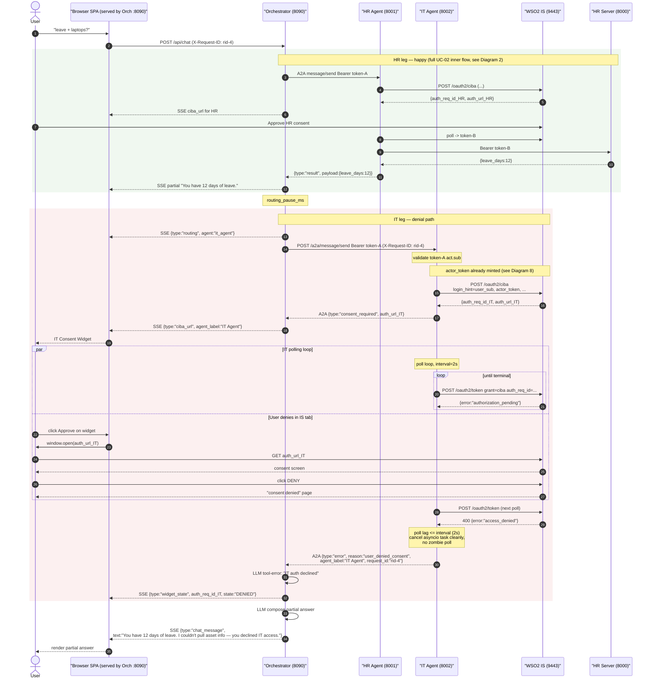
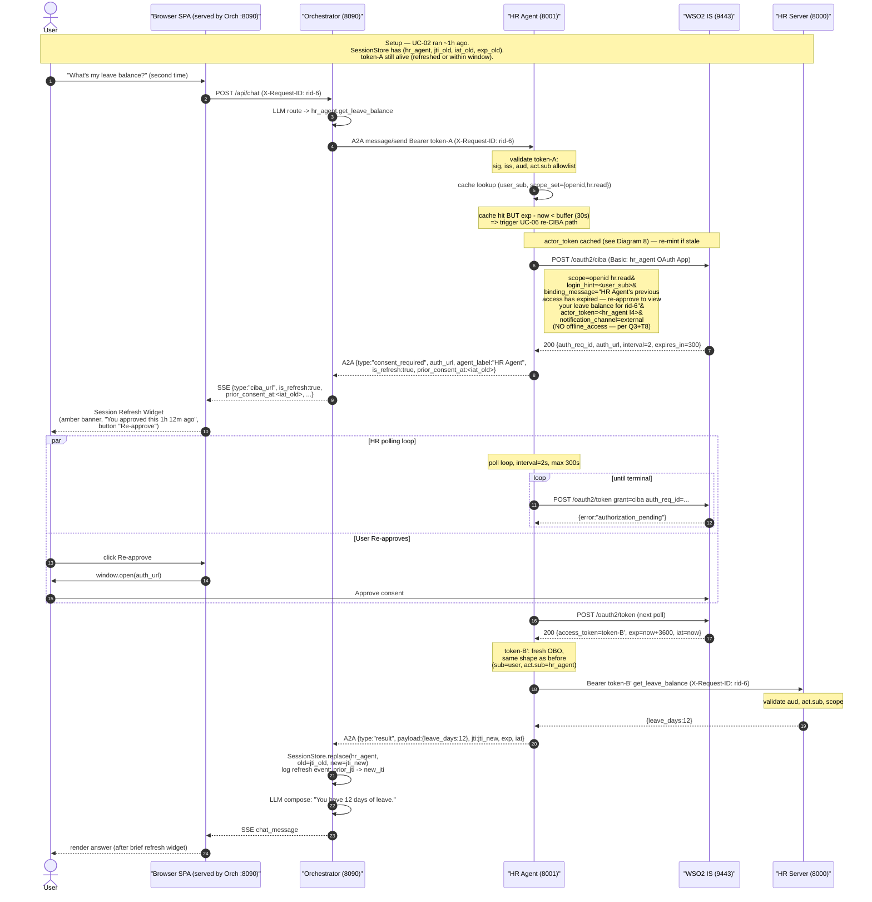
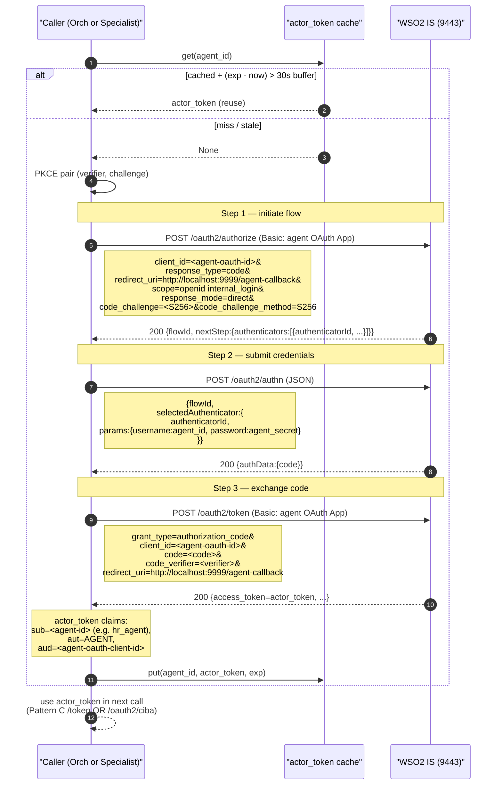

# Sequence Diagrams — Sprint 1 Use Cases

This document contains Mermaid `sequenceDiagram` blocks for UC-01 through UC-06 plus an 8th sub-flow diagram covering the App-Native Auth `actor_token` mint that several of the per-specialist CIBA flows depend on.

Cross-references:
- [`../use-cases/UC-01-user-login.md`](../use-cases/UC-01-user-login.md) ... [`UC-06`](../use-cases/UC-06-token-expiry-mid-conversation.md)
- [`../milestone-plan.md`](../milestone-plan.md) §2 (Hops 1–5)
- [`module-layout.md`](./module-layout.md) (companion)
- [`api-contracts.md`](./api-contracts.md) (companion)

**Naming conventions used (consistent across all diagrams):**

| Symbol | Meaning |
|---|---|
| `User` | The human at the keyboard |
| `SPA` | The browser SPA — static HTML/JS **served by the orchestrator** at `localhost:8090` (no separate SPA host or OAuth client) |
| `Orch` | Orchestrator backend (`localhost:8090`; container listens on `8080`) |
| `HR` | hr_agent A2A backend (`localhost:8001`) |
| `IT` | it_agent A2A backend (`localhost:8002`) |
| `IS` | WSO2 IS 7.2 (`https://<vm>:9443`) |
| `HR-MCP` | hr_server MCP backend (`localhost:8000`) |
| `IT-MCP` | it_server MCP backend (`localhost:8004`) |
| **token-A** | `sub=user, act.sub=orchestrator-agent, aud=orchestrator-mcp-client` — Pattern C |
| **token-B** | `sub=user, act.sub=hr_agent, aud=hr_agent-OAuth-Client-ID` — HR's OBO |
| **token-C** | `sub=user, act.sub=it_agent, aud=it_agent-OAuth-Client-ID` — IT's OBO |
| **actor_token** | An agent's I4 token (`sub=<agent>, aut=AGENT`) minted via App-Native Auth |
| **SSE** | Server-Sent Events stream `Orch -> SPA` over `GET /events/{session_id}` |

---

## Diagram 1 — UC-01: User login (Pattern C)

This shows the authorization-code+PKCE flow that produces **token-A**, the orchestrator's session token. The crucial detail is that a **single confidential client** (`orchestrator-mcp-client`) drives both legs: it is named on `/oauth2/authorize` (browser redirect) **and** authenticates the `/oauth2/token` code-exchange — IS rejects redeeming a code under a different client than the one it was issued to. Pattern C requires `actor_token` on `/oauth2/token`, which only a confidential authenticator can carry. The browser UI is served by the orchestrator itself (port 8090); there is no separate public SPA OAuth app. The orchestrator mints the agent's actor_token via App-Native Auth (see Diagram 8) before the code-exchange. What this elides: PKCE verifier/challenge generation details, JWKS bootstrap, and cookie internals; we show the cookie set as a single arrow.

```mermaid
sequenceDiagram
    autonumber
    actor User
    participant SPA as "Browser SPA (served by Orch :8090)"
    participant Orch as "Orchestrator (8090)"
    participant IS as "WSO2 IS (9443)"

    User->>SPA: click "Sign in"
    SPA->>SPA: generate PKCE (verifier, challenge), state
    SPA->>User: 302 to IS /oauth2/authorize
    Note right of SPA: GET /oauth2/authorize?<br/>client_id=orchestrator-mcp-client&<br/>response_type=code&<br/>redirect_uri=.../agent-callback&<br/>scope=openid orchestrate&<br/>state=...&code_challenge=...&<br/>requested_actor=orchestrator-agent

    User->>IS: GET /oauth2/authorize
    IS-->>User: login page
    User->>IS: POST credentials
    IS-->>User: consent ("orchestrator-agent wants to act on your behalf")
    User->>IS: Approve
    IS-->>SPA: 302 http://localhost:8090/agent-callback?code=...&state=...

    SPA->>Orch: POST /auth/exchange {code, state, code_verifier}
    Note over Orch: validate state matches a pending login

    Note over Orch,IS: actor_token already minted<br/>(see Diagram 8 — App-Native Auth)<br/>for orchestrator-agent

    Orch->>IS: POST /oauth2/token (Basic auth: orchestrator-mcp-client)
    Note right of Orch: grant_type=authorization_code&<br/>code=...&code_verifier=...&<br/>redirect_uri=...&<br/>actor_token=<orchestrator-agent I4>
    IS-->>Orch: 200 {access_token=token-A, ...}
    Note over Orch: validate token-A:<br/>sub=user-uuid, aut=APPLICATION_USER,<br/>act.sub=orchestrator-agent,<br/>aud=orchestrator-mcp-client, scope=openid orchestrate

    Orch->>Orch: SessionStore.create(session_id, user_sub, token_a, exp)
    Orch-->>SPA: 200 Set-Cookie orch_sid=<opaque>; Secure; HttpOnly; SameSite=Lax
    SPA->>Orch: GET /events/{session_id} (SSE open)
    Orch-->>SPA: SSE: {type:"session_ready"}
    SPA-->>User: chat view, header shows username
```

---

## Diagram 2 — UC-02: Single-specialist query (HR)

This is the canonical happy path: one specialist, one CIBA round-trip, one MCP call. It illustrates Hops 2–5 of `milestone-plan.md` §2 and threads `X-Request-ID` through every leg. The `par` block highlights the asynchronous cross-cut where HR is polling `/oauth2/token` while the SPA is rendering the consent widget and the user is approving in a separate IS tab. What this elides: actor_token minting (see Diagram 8), keyword-fallback router behavior, and the LLM's prompt details — we show the LLM as a single decision step.

```mermaid
sequenceDiagram
    autonumber
    actor User
    participant SPA as "Browser SPA (served by Orch :8090)"
    participant Orch as "Orchestrator (8090)"
    participant HR as "HR Agent (8001)"
    participant IS as "WSO2 IS (9443)"
    participant HR-MCP as "HR Server (8000)"

    User->>SPA: type "What's my leave balance?"
    SPA->>Orch: POST /api/chat {user_message}<br/>Cookie: orch_sid; X-Request-ID: rid-1
    Orch->>Orch: LLM/keyword route -> hr_agent.get_leave_balance
    Orch-->>SPA: SSE {type:"routing", agent:"hr_agent"}

    Orch->>HR: POST /a2a/message/send<br/>Authorization: Bearer token-A<br/>X-Request-ID: rid-1<br/>{tool:"get_leave_balance", args:{}}
    Note over HR: validate token-A:<br/>JWKS sig, iss=IS, aud=orchestrator-mcp-client,<br/>act.sub IN HR_TRUSTED_PEER_AGENTS<br/>extract user_sub = token_a.sub

    Note over HR,IS: actor_token already minted<br/>(see Diagram 8) — cached, re-mint if stale

    HR->>IS: POST /oauth2/ciba (Basic: hr_agent OAuth App)
    Note right of HR: scope=openid hr.read&<br/>login_hint=<user_sub>&<br/>binding_message="HR wants to view<br/>your leave balance for rid-1"&<br/>actor_token=<hr_agent I4>&<br/>notification_channel=external
    IS-->>HR: 200 {auth_req_id, auth_url, interval=2, expires_in=300}

    HR-->>Orch: A2A 200 {type:"consent_required", auth_req_id, auth_url, agent_label:"HR Agent"}
    Orch-->>SPA: SSE {type:"ciba_url", agent_label, auth_url, binding_code, expires_in}
    SPA-->>User: render Consent Widget (Awaiting state)

    par HR polling loop
        Note over HR: poll loop, max 300s, interval=2s
        loop until token | error | deadline
            HR->>IS: POST /oauth2/token (Basic: hr_agent OAuth App)<br/>grant_type=urn:openid:params:grant-type:ciba&<br/>auth_req_id=...
            IS-->>HR: 400 {error:"authorization_pending"}
        end
    and User consent in IS tab
        User->>SPA: click Approve on widget
        SPA->>User: window.open(auth_url)
        User->>IS: GET auth_url
        IS-->>User: consent screen (binding_code shown)
        User->>IS: Approve
        IS-->>User: "you may close this window"
    end

    HR->>IS: POST /oauth2/token (next poll)
    IS-->>HR: 200 {access_token=token-B, ...}
    Note over HR: token-B:<br/>sub=user, act.sub=hr_agent,<br/>aud=hr_agent-OAuth-Client-ID,<br/>scope=openid hr.read

    HR->>HR-MCP: POST /tools/get_leave_balance<br/>Authorization: Bearer token-B<br/>X-Request-ID: rid-1
    Note over HR-MCP: validate token-B:<br/>sig, iss, aud == HR_AGENT_OAUTH_CLIENT_ID,<br/>act.sub == hr_agent-id, scope has hr.read
    HR-MCP-->>HR: 200 {leave_days: 12}

    HR-->>Orch: A2A 200 {type:"result", payload:{leave_days:12}, jti, exp, iat}
    Orch->>Orch: SessionStore.record(hr_agent, jti, exp, iat, auth_req_id)
    Orch->>Orch: LLM compose: "You have 12 days of leave."
    Orch-->>SPA: SSE {type:"chat_message", text:"You have 12 days of leave."}
    SPA-->>User: render answer in chat
```

---

## Diagram 3 — UC-03: Two-specialist serial query (HR then IT)

The headline demo. Per Q2 the orchestrator runs HR fully (UC-02 in full) before starting IT — there is no parallel fan-out. Two distinct CIBA round-trips produce two unrelated OBO tokens (token-B, token-C); they are NOT a chain, just both depth-1 with different `act.sub`. What this elides: the inner detail of each CIBA leg (collapsed to a `Note` referencing UC-02 / Diagram 2) so the diagram stays readable; see Diagram 2 for the per-leg detail. The diagram emphasizes the `routing_pause_ms` gap that lets the user read the HR answer before the IT widget appears.

```mermaid
sequenceDiagram
    autonumber
    actor User
    participant SPA as "Browser SPA (served by Orch :8090)"
    participant Orch as "Orchestrator (8090)"
    participant HR as "HR Agent (8001)"
    participant IT as "IT Agent (8002)"
    participant IS as "WSO2 IS (9443)"
    participant HR-MCP as "HR Server (8000)"
    participant IT-MCP as "IT Server (8004)"

    User->>SPA: "Show my leave balance and what laptops are available"
    SPA->>Orch: POST /api/chat<br/>Cookie: orch_sid; X-Request-ID: rid-2
    Orch->>Orch: LLM produces tool sequence:<br/>[(hr_agent, get_leave_balance),<br/> (it_agent, list_available_assets)]

    rect rgb(240, 248, 240)
        Note over Orch,HR-MCP: HR leg — full UC-02 inner flow (see Diagram 2)
        Orch-->>SPA: SSE {type:"routing", agent:"hr_agent"}
        Orch->>HR: POST /a2a/message/send (Bearer token-A)
        Note over HR: validate token-A act.sub allowlist
        HR->>IS: POST /oauth2/ciba (login_hint, actor_token, ...)
        IS-->>HR: {auth_req_id_HR, auth_url_HR}
        HR-->>Orch: A2A {type:"consent_required", auth_url_HR}
        Orch-->>SPA: SSE {type:"ciba_url", agent_label:"HR Agent", auth_url_HR}
        SPA-->>User: HR Consent Widget
        User->>IS: open auth_url_HR, Approve
        HR->>IS: POST /oauth2/token (poll) -> token-B
        Note over HR: token-B: sub=user, act.sub=hr_agent
        HR->>HR-MCP: Bearer token-B GET get_leave_balance
        Note over HR-MCP: validate aud=HR_AGENT_OAUTH_CLIENT_ID,<br/>act.sub=hr_agent
        HR-MCP-->>HR: {leave_days:12}
        HR-->>Orch: A2A {type:"result", payload:{leave_days:12}}
        Orch->>Orch: SessionStore.record(hr_agent, jti_B, ...)
        Orch-->>SPA: SSE {type:"partial_result", text:"You have 12 days of leave."}
    end

    Note over Orch: routing_pause_ms (default 500ms)<br/>so user reads HR answer before IT widget

    rect rgb(240, 240, 248)
        Note over Orch,IT-MCP: IT leg — same shape, IT substituted for HR
        Orch-->>SPA: SSE {type:"routing", agent:"it_agent"}
        Orch->>IT: POST /a2a/message/send (Bearer token-A)
        Note over IT: validate token-A act.sub allowlist
        IT->>IS: POST /oauth2/ciba (login_hint, actor_token_IT, ...)
        IS-->>IT: {auth_req_id_IT, auth_url_IT}
        IT-->>Orch: A2A {type:"consent_required", auth_url_IT}
        Orch-->>SPA: SSE {type:"ciba_url", agent_label:"IT Agent", auth_url_IT}
        SPA-->>User: IT Consent Widget
        User->>IS: open auth_url_IT, Approve
        IT->>IS: POST /oauth2/token (poll) -> token-C
        Note over IT: token-C: sub=user, act.sub=it_agent<br/>(NOT a chain with token-B)
        IT->>IT-MCP: Bearer token-C GET list_available_assets
        Note over IT-MCP: validate aud=IT_AGENT_OAUTH_CLIENT_ID,<br/>act.sub=it_agent
        IT-MCP-->>IT: {assets:["MBP-14","MBP-16","XPS-13"]}
        IT-->>Orch: A2A {type:"result", payload:{assets:[...]}}
        Orch->>Orch: SessionStore.record(it_agent, jti_C, ...)
    end

    Orch->>Orch: LLM compose final combined reply
    Orch-->>SPA: SSE {type:"chat_message",<br/>text:"You have 12 days of leave. Available laptops: MBP-14, MBP-16, XPS-13."}
    SPA-->>User: render combined answer
```

---

## Diagram 4 — UC-04: User denies consent (mid-flow)

This is the failure path — the diagram's whole point. We show Variant A (deny in the IS consent screen) which is the most common case, and the EX-3 mid-flow combination (HR ok, IT denied) which is the most informative for the LLM-recovery copy. The polling loop on the IT side picks up `access_denied` within `interval` seconds; the orchestrator composes a partial answer instead of erroring. What this elides: Variant B (Deny clicked directly on the SPA widget — covered in UC-04 Variant B) and the full re-display of the HR leg (collapsed to a `rect` block).



---

## Diagram 5 — UC-05: Browser closed during CIBA polling

This is the failure path that has security weight: orchestrator MUST detect SSE disconnection, cancel the in-flight polling task, and not leak orphan tokens or zombie loops. We show Variant A (user closes BEFORE clicking Approve) because it's the cleaner case — no token is ever issued. Variant B (close AFTER Approve) is shown as an alternative branch via a `Note` rather than a separate diagram. What this elides: TCP keepalive timing internals (we show "10–30s" as a single hop), the optional Sprint 3 `auth_req_id` cancellation against IS (gated on capability test C10), and EX-2 re-attach (described in the UC doc).

```mermaid
sequenceDiagram
    autonumber
    actor User
    participant SPA as "Browser SPA (served by Orch :8090)"
    participant Orch as "Orchestrator (8090)"
    participant HR as "HR Agent (8001)"
    participant IS as "WSO2 IS (9443)"

    Note over User,IS: Setup — UC-02 has reached step 11<br/>(Consent Widget rendered, HR polling)

    User->>SPA: chat "leave balance?"
    SPA->>Orch: POST /api/chat (X-Request-ID: rid-5)
    Orch->>HR: A2A message/send Bearer token-A
    Note over HR: validate token-A
    HR->>IS: POST /oauth2/ciba (...)
    IS-->>HR: {auth_req_id, auth_url, interval=2, expires_in=300}
    HR-->>Orch: A2A {type:"consent_required", auth_url}
    Orch-->>SPA: SSE {type:"ciba_url", auth_url, expires_in}
    SPA-->>User: Consent Widget visible

    par HR polling loop active
        Note over HR: poll loop, interval=2s, max 300s
        loop
            HR->>IS: POST /oauth2/token grant=ciba auth_req_id=...
            IS-->>HR: {error:"authorization_pending"}
        end
    and User closes browser BEFORE approving
        User->>SPA: close tab / quit browser / lose network
        SPA-XOrch: SSE TCP connection drops
    end

    Note over Orch: SSE keepalive (15s no-op comments)<br/>fails to flush -> EventSource broken<br/>detection latency: 10-30s

    Orch->>Orch: SessionStore.mark_disconnected(session_id)<br/>state={status:"user_disconnected"}
    Orch->>HR: cancel(auth_req_id)<br/>(in-process call by auth_req_id)
    Note over HR: task.cancel() on poll asyncio.Task<br/>idempotent — no-op if already done
    HR->>HR: poll loop -> CancelledError, cleanup

    Note over HR,IS: Sprint 3 (gated on C10):<br/>HR may signal IS to invalidate auth_req_id.<br/>Sprint 1: rely on natural expiry at expires_in (300s).

    Note over IS: auth_req_id sits unused;<br/>expires after 300s.<br/>No token ever issued.

    alt Variant B — user closed AFTER Approve
        Note over User,HR: User had already approved at IS<br/>before closing the tab.<br/>HR's next poll DOES return token-B.<br/>Orch sees SSE dead, does NOT push.<br/>Token-B sits in SessionStore unused;<br/>expires naturally at exp (3600s).<br/>Sprint 3 will revoke on session timeout.
    end
```

---

## Diagram 6 — UC-06: Token expiry mid-conversation (re-CIBA, "Session Refresh")

This is the path that is structurally a happy flow but semantically distinct: the user approved this specialist before, the OBO expired, and we need to re-CIBA with a Session-Refresh-flavoured `binding_message` and widget treatment. The diagram shows the cache hit-but-expired check and the differentiated SSE event (`is_refresh: true, prior_consent_at`). What this elides: the inner CIBA poll loop (collapsed to a single arrow pair — see Diagram 2 for the polling detail), the SPA's Session-Refresh widget visual treatment (covered in `consent-widget-spec.md` §4), and EX-2 (token-A also expired -> full re-login UC-01).



---

## Diagram 7 — UC-04 / Variant B alternate: user denies on the SPA widget directly

Brief alternate-path diagram for the "user clicks Deny on the SPA widget itself, never opens the IS auth_url" branch of UC-04 (Variant B from the UC doc). This is included because it has a distinct cancellation channel (orchestrator -> specialist in-process cancel) that doesn't appear elsewhere. Sprint 1 stops at "specialist cancels its own poll"; the optional `auth_req_id` invalidation against IS is Sprint 3 (gated on capability test C10).

```mermaid
sequenceDiagram
    autonumber
    actor User
    participant SPA as "Browser SPA (served by Orch :8090)"
    participant Orch as "Orchestrator (8090)"
    participant HR as "HR Agent (8001)"
    participant IS as "WSO2 IS (9443)"

    Note over User,IS: Setup: UC-02 reached the consent widget.<br/>HR is polling /oauth2/token.

    SPA-->>User: HR Consent Widget visible
    User->>SPA: click DENY on the widget (no IS round-trip)

    SPA->>Orch: POST /api/ciba/cancel {auth_req_id}<br/>Cookie: orch_sid; X-Request-ID: rid-4b
    Orch->>HR: cancel(auth_req_id) [in-process]
    Note over HR: task.cancel() on poll asyncio.Task<br/>idempotent

    Note over HR,IS: Sprint 3 only (gated on C10):<br/>HR may POST /oauth2/<some-cancel> to IS.<br/>Sprint 1: skip — auth_req_id expires naturally.

    HR-->>Orch: A2A {type:"error", reason:"user_denied_consent_local",<br/>agent_label, request_id}
    Orch->>Orch: LLM tool-error: "user declined locally"
    Orch-->>SPA: SSE {type:"widget_state", auth_req_id, state:"DENIED"}
    Orch-->>SPA: SSE {type:"chat_message",<br/>text:"I couldn't access HR information (declined). Ask again if you'd like to retry."}
    SPA-->>User: widget transitions to "Declined" line in transcript

    Note over IS: auth_req_id sits, expires at expires_in.<br/>No token issued.
```

---

## Diagram 8 — actor_token mint via App-Native Auth (3-step, sub-flow)

Referenced as a `Note` in diagrams 1, 2, 3, 4, 6 ("actor_token already minted (see Diagram 8)"). This is the standard 3-step App-Native Auth flow that produces an agent's I4 token (`sub=<agent-id>, aut=AGENT`). It's used by:
- The orchestrator backend to produce the `actor_token` parameter on Pattern C `/oauth2/token` (UC-01)
- Each specialist agent to produce the `actor_token` parameter on `/oauth2/ciba` (UC-02 step 7, UC-03 both legs, UC-04 IT leg, UC-06)

The wire-level shape is mirrored from `idp_capability_test/c8_ciba.py:mint_agent_token_via_authn`. What this elides: PKCE verifier/challenge generation (shown as a single step), error paths on each of the three IS calls, and the `actor_token_provider` cache (shown as a single check at the start). The token is cached with a 30-second buffer before TTL; this diagram shows the cold-mint path.



---

## Cross-reference index

| UC | Diagram | Relies on | Endpoints introduced |
|---|---|---|---|
| UC-01 | 1 | 8 (actor_token mint) | `POST /auth/exchange`, `GET /events/{session_id}` (SSE) |
| UC-02 | 2 | 8 | `POST /api/chat`, `POST /a2a/message/send` (HR), `POST /oauth2/ciba`, `POST /oauth2/token` (CIBA grant), `GET /tools/get_leave_balance` (HR-MCP) |
| UC-03 | 3 | 2, 8 | `POST /a2a/message/send` (IT), `GET /tools/list_available_assets` (IT-MCP) |
| UC-04 | 4, 7 | 2, 3, 8 | `POST /api/ciba/cancel` (Variant B only) |
| UC-05 | 5 | 2 | (none new) — uses SSE drop detection |
| UC-06 | 6 | 2, 8 | (none new) — re-runs UC-02 with `is_refresh` flag |

`api-contracts.md` will define the request/response shape for each endpoint; `module-layout.md` will map the participants here onto Python packages.
