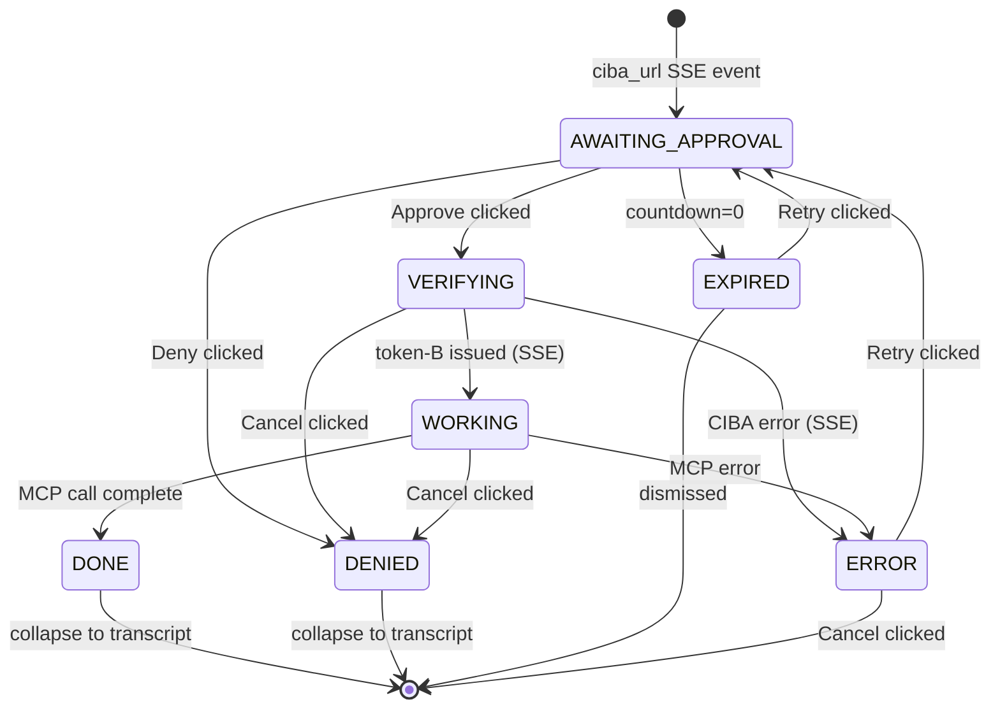
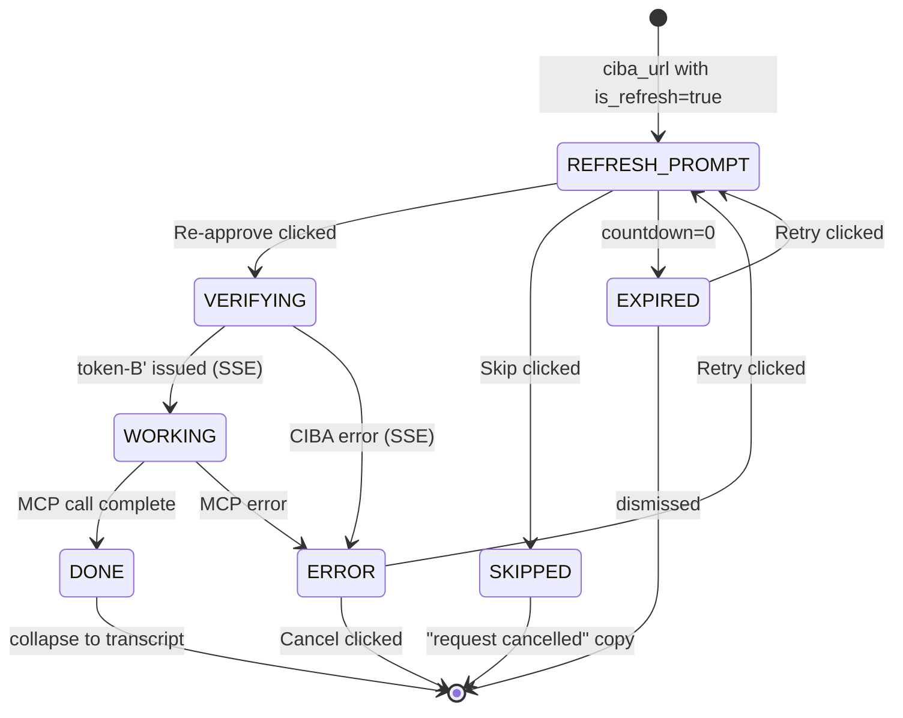
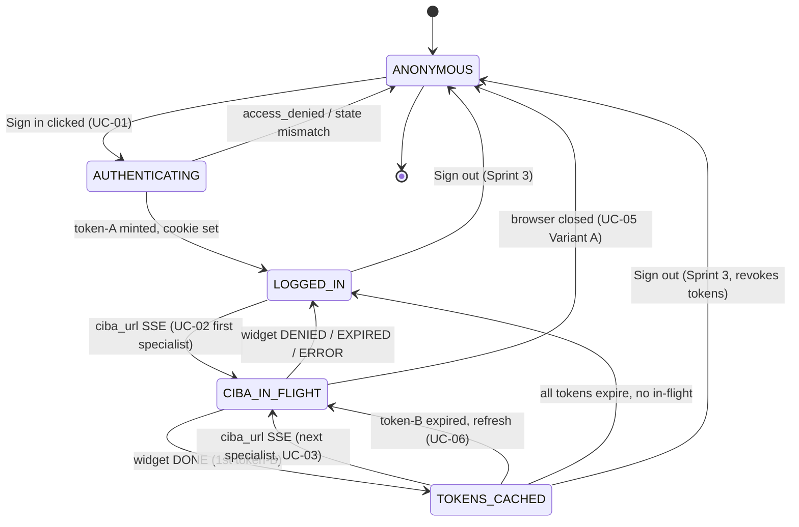
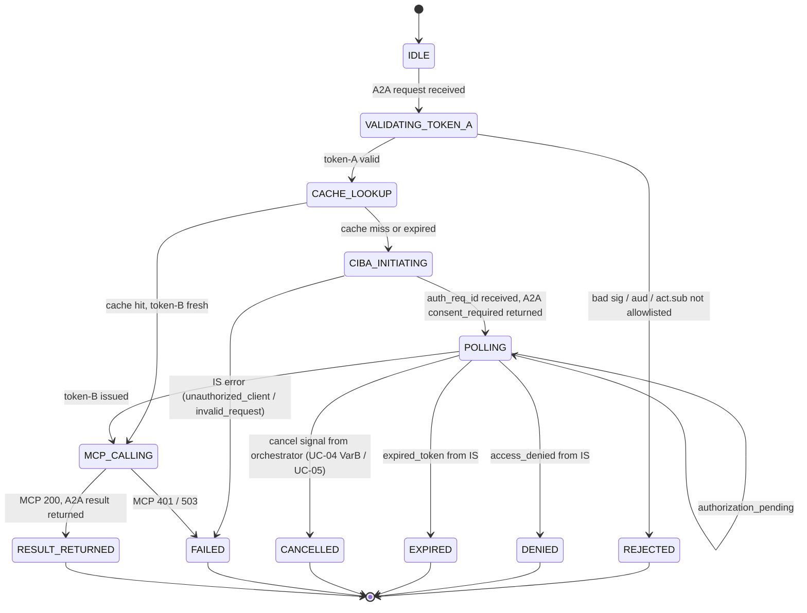
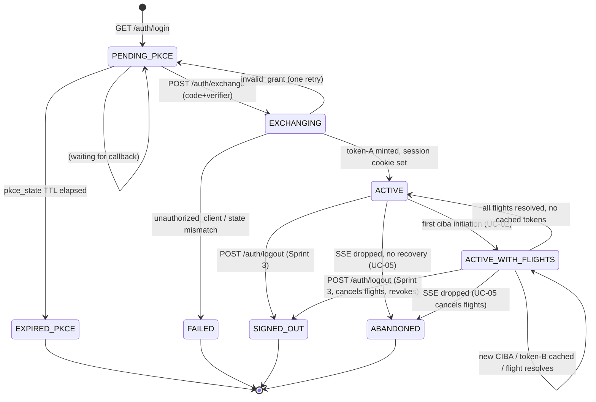

# State Diagrams — Smart Employee Agent POC

**Sprint 1, Stage 3 deliverable.**
**Date:** 2026-05-07
**Companion docs:** [`consent-widget-spec.md`](../consent-widget-spec.md), [`use-cases/UC-01..UC-06`](../use-cases/)

This file translates the prose state lists in `consent-widget-spec.md` §3 and the
flow narratives in UC-01 through UC-06 into Mermaid `stateDiagram-v2` diagrams
that render in any Markdown viewer with Mermaid support (GitHub, VS Code,
mkdocs-material, Obsidian).

---

## How to read these diagrams

- **`[*]`** marks a starting or terminal state. An arrow from `[*]` is the
  entry point; an arrow to `[*]` is a clean termination of the surface's
  lifetime (widget collapses to a transcript line, session ends, etc.).
- **Transition labels** (`State1 --> State2 : event`) name the event or
  condition that drives the transition — usually a user action (`Approve
  clicked`), an SSE event from the orchestrator (`ciba_url received`),
  a timer (`countdown=0`), or an HTTP/RPC outcome (`token-B issued`).
- **Error branches** are written with the same `: ` label syntax; states named
  `ERROR`, `DENIED`, `EXPIRED` are rendered identically — the diagrams do not
  use Mermaid's color hints because consistent rendering across viewers
  matters more than colour.
- **Composite/parallel states** are avoided — each diagram covers one surface.
  Cross-surface coordination (SPA widget vs. specialist polling vs. orchestrator
  session map) is shown by having one diagram reference its sibling in the
  prose above it, not by drawing them in the same chart.
- **Out-of-scope edges** (e.g., dark mode, parallel fan-out) are deliberately
  omitted; the prose above each diagram calls out what is NOT shown.

---

## 1. Consent Widget — primary states

This is the **SPA-side** widget state machine for a single CIBA approval card,
covering the seven states defined in `consent-widget-spec.md` §3
(AWAITING_APPROVAL, VERIFYING, WORKING, DONE, DENIED, EXPIRED, ERROR). It does
NOT show the Session Refresh variant (see diagram 2 below) and does NOT show
the orchestrator-side polling lifecycle (see diagram 4). The Cancel button
during VERIFYING/WORKING routes the widget into DENIED (per spec §3 footnote).

---

## 2. Consent Widget — Session Refresh variant (UC-06)

Triggered when a specialist's previously issued token-B has expired and the
user submits a follow-up query that needs the same scope. Visually distinct
from diagram 1 (amber banner, "You approved this 1h 12m ago", **Re-approve** /
**Skip** labels) but the underlying state graph is a trimmed superset of
the primary widget. The fresh-consent path on first-ever request for this
specialist is NOT shown here — that's diagram 1.

---

## 3. SPA session lifecycle (UC-01, UC-02, UC-03, UC-05, UC-06)

Tracks the **SPA's view** of the orchestrator-issued session — from anonymous
through login to having one or more specialist tokens cached server-side, plus
the Sprint 3 sign-out terminus. `TOKENS_CACHED` is a single state with a
counter rather than separate per-specialist states, because the SPA does not
hold token-B itself — it just observes how many distinct specialists the
orchestrator has approved tokens for in this session. Detailed widget states
during each CIBA flow are NOT shown here (see diagrams 1 and 2).

---

## 4. Specialist (HR / IT Agent) per-request lifecycle (UC-02, UC-04, UC-05)

Per-request lifecycle inside an HR or IT agent, from inbound A2A call through
CIBA initiation, polling, and MCP call. This is a **single-request** machine:
each new A2A `message/send` starts a fresh instance from `IDLE`. Cross-request
state (the agent's actor-token cache, the per-`(user_sub, scope)` token-B
cache) is NOT modelled here — those are background concerns. Token-B cache hit
shortcuts to `MCP_CALLING` directly; cache miss or expiry kicks off CIBA.

---

## 5. Orchestrator session lifecycle (UC-01 through UC-06)

The **server-side** session record in the orchestrator backend, from the PKCE
state created at sign-in click through the active session that holds token-A
and a map of in-flight CIBA flows plus issued specialist tokens. Per-request
A2A interactions with specialists are NOT shown — see diagram 4. Multiple
in-flight CIBA flows in `ACTIVE_WITH_FLIGHTS` are conceptually a list, not
separate states; the diagram tracks the session's lifecycle, not each CIBA
substate.

---

## Cross-references

| Diagram | Drives / drives from |
|---|---|
| 1. Widget primary | Diagram 4 `CIBA_INITIATING` --> `POLLING` --> `MCP_CALLING` is what the widget observes via SSE proxy through diagram 5 |
| 2. Widget refresh | Same as diagram 1, plus `prior_consent_at` from the specialist's per-`(user_sub, scope)` cache |
| 3. SPA session | The SPA's projection of diagram 5; loses fidelity on per-flight detail intentionally |
| 4. Specialist | Owns the actual CIBA poll loop; cancellation arrives from diagram 5 |
| 5. Orchestrator session | Aggregates 0..N in-flight diagram-4 instances and 0..N cached token-B records |

For the human-narrative version of these flows, see UC-01 through UC-06 in
[`../use-cases/`](../use-cases/). For the visual/copy treatment of each widget
state, see [`../consent-widget-spec.md`](../consent-widget-spec.md) §3 and §4.
